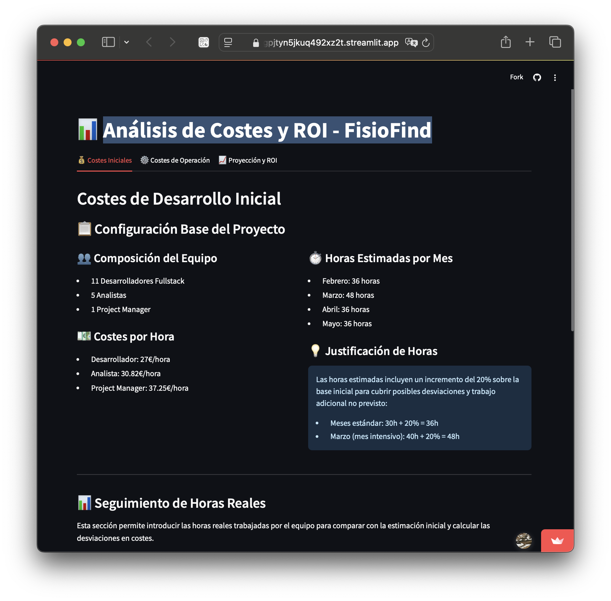
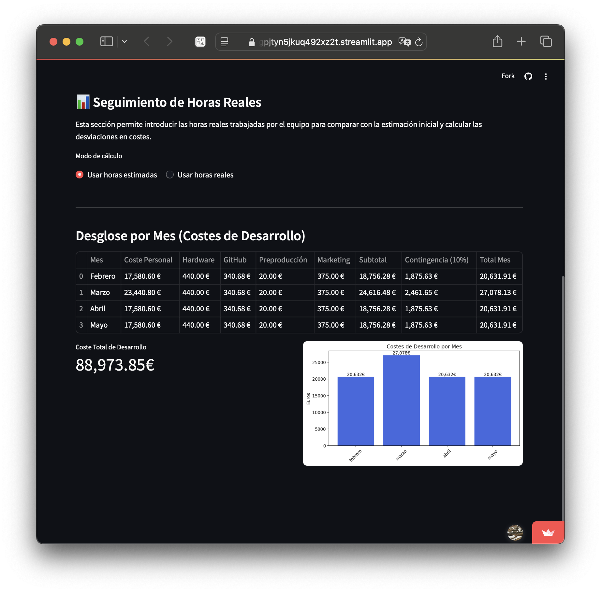

<!-- COMMENT THIS WHEN EXPORTING TO PDF -->

  

<h1 align="center" style="font-size: 30px; font-weight: bold;">
  FISIO FIND  -  DESGLOSE DE LOS COSTES
</h1>

 

**ÍNDICE**
- [**1. INTRODUCCIÓN**](#1-introducción)
- [**2. COSTES DE DESARROLLO (CapEx)**](#2-costes-de-desarrollo-capex)
  - [**2.1. COSTES DE PERSONAL Y HORAS DE TRABAJO**](#21-costes-de-personal-y-horas-de-trabajo)
  - [**2.2. COSTES DE REEMPLAZO DE HARDWARE Y LICENCIAS**](#22-costes-de-reemplazo-de-hardware-y-licencias)
- [**3. COSTES DE PRODUCCIÓN Y DESPLIEGUE (OpEx)**](#3-costes-de-producción-y-despliegue-opex)
- [**4. COSTES DE MANTENIMIENTO Y SOPORTE**](#4-costes-de-mantenimiento-y-soporte)
- [**5. COSTES DE MARKETING**](#5-costes-de-marketing)
- [**6. ESTIMACIÓN DE RETORNO DE INVERSIÓN**](#6-estimación-de-retorno-de-inversión)
  - [**2.5. CÁLCULO DE COSTES MENSUALES**](#25-cálculo-de-costes-mensuales)
<!-- COMMENT WHEN EXPORTING TO PDF -->

 

---

**Ficha del documento**

- **Nombre del Proyecto:** FISIO FIND

- **Número de Grupo:** Grupo 6

- **Entregable:** #DP

- **Miembros del grupo:** Alberto Carmona Sicre, Antonio Macías Ferrera, Benjamín Ignacio Maureira Flores, Francisco Capote García, Daniel Alors Romero, Daniel Fernández Caballero, Daniel Ruiz López, Daniel Tortorici Bartús, Daniel Vela Camacho, Delfín Santana Rubio, Guadalupe Ridruejo Pineda, Julen Redondo Pacheco, Miguel Encina Martínez, Francisco Mateos Villarejo, Pablo Fernández Pérez, Ramón Gavira Sánchez, Rafael Pulido Cifuentes.

- **Autores:** Antonio Macías Ferrera, Ramón Gavira Sánchez, Pablo Fernández Pérez

- **Fecha de Creación:** 19/02/2025  

- **Versión:** v1.2

 

---

**Historial de modificaciones**

| Fecha         | Versión | Realizada por                               | Descripción de los cambios                       |
| ------------- | ------- | ------------------------------------------- | ------------------------------------------------ |
| 19/02/2025    | v1.0    | Ramón Gavira Sánchez, Pablo Fernández Pérez | Elaboración de la primera versión del documento. |
| 19/02/2025    | v1.1    | Antonio Macías Ferrera                      | Adición del resto de puntos del documento de acuerdo con el *Sprint Planning* general. |
| 24/02/2025    | v1.2    | Antonio Macías Ferrera                      | Modificación del documento para añadir desglose detallado de costes de acuerdo con el *feedback* de la clase del pasado 21/02. |

 

<!-- \newpage -->

 

# **1. INTRODUCCIÓN**

Este documento detalla el desglose de los costes asociados al desarrollo, producción y despliegue del proyecto **FisioFind**. Se incluyen cálculos basados en horas de trabajo, tarifas por perfil, costes de hardware, licencias, producción, mantenimiento, marketing y soporte. Además, se incorpora una estimación del retorno de inversión (ROI) y se detallan ejemplos de cálculo para ciertos conceptos (por ejemplo, alojamiento de videos).

A modo de resumen, se han obtenido los siguientes valores (todos en euros):

- **Coste de Desarrollo (CapEx) sin margen:** 78.624 €

- **Coste de Desarrollo + Margen (10%):** 86.487 €

- **Coste del Primer Año (TCO Primer Año):** 119.457 €

- **Coste del Segundo Año (TCO Segundo Año):** 24.595 €

- **Reserva para Reemplazo de Hardware (solo primer año):** 5.280 €

> **Nota:** Algunos conceptos (por ejemplo, alojamiento de videos) se analizan de forma separada y pueden no incluirse en el TCO global, pero se consideran en el análisis del ROI.

 

# **2. COSTES DE DESARROLLO (CapEx)**

Esta sección recoge el coste del desarrollo inicial de la aplicación, incluyendo el coste del personal y las inversiones en hardware y licencias necesarias.

## **2.1. COSTES DE PERSONAL Y HORAS DE TRABAJO**

El equipo de desarrollo de FisioFind está compuesto por **17 personas**, distribuidas de la siguiente manera:

- **5 Analistas**
- **1 Project Manager (PM)**
- **11 Desarrolladores Fullstack**

Cada integrante debe trabajar un mínimo de **161 horas** mensuales (horas mínimas +15%). Estos roles asumirán los costes de desarrollo que deberán rentabilizarse a largo plazo para lograr el retorno de inversión.

 

**COSTE POR HORA SEGÚN PERFIL**

Antes de rentabilizar la aplicación, se estima el siguiente número de horas de trabajo por mes:

- **Febrero, Abril y Mayo:** 30 horas + **20% de incremento** → **36 horas**

- **Marzo:** 40 horas + **20% de incremento** → **48 horas**

Se utilizan las siguientes tarifas por hora:

- **Analista:** 30,82 €/hora  

- **Project Manager:** 37,25 €/hora  

- **Desarrollador:** 27 €/hora  

 

**CÁLCULOS**

El cálculo del coste mensual se realiza multiplicando las horas por el coste horario de cada perfil.

1. **Analistas:**  
   - Total de horas: 5 × 161 = 805 horas  
   - Coste: 805 × 30,82 = **24.810,10 €**

2. **Project Manager:**  
   - Total de horas: 1 × 161 = 161 horas  
   - Coste: 161 × 37,25 = **5.997,25 €**

3. **Desarrolladores Fullstack:**  
   - Total de horas: 11 × 161 = 1.771 horas  
   - Coste: 1.771 × 27 = **47.817,00 €**

4. **Coste Total de Personal (CapEx Base):**  
   - Suma: 24.810,10 € + 5.997,25 € + 47.817,00 € = **78.624,35 €**

5. **Aplicando un margen del 10%:**  
   - 78.624,35 € × 1,10 ≈ **86.487 €**

El coste de desarrollo mensual variará según el mes, ya que depende de las horas de trabajo asignadas. Una vez sumados todos los costes mensuales, se aplicará un **10% de margen de contingencia**.

## **2.2. COSTES DE REEMPLAZO DE HARDWARE Y LICENCIAS**

**COSTES DE HARDWARE**

Se estima que la **vida útil media de un equipo es de 3 años**, lo que implica que cada año se debe renovar **1/3 de los equipos**. El coste medio de un equipo es **800€**, por lo que:

- Se renuevan aproximadamente 5,5 equipos al año:
  - Renovación anual: 5,5 × 800 € = **4.400 €**

- **Aplicando un margen de contingencia del 20%:**  
  - 4.400 € × 1,20 = **5.280 €/año**  
  - Este coste se considera únicamente en el primer año (desarrollo inicial).  
  - **Coste mensual de hardware:** 5.280 € / 12 ≈ **440 €/mes**

Este coste se sumará a los costes de desarrollo y será constante en el tiempo.

 

**COSTES DE LICENCIAS Y HERRAMIENTAS**

1. **GitHub Enterprise:**
   Se utilizará **GitHub Enterprise** para la gestión del código del equipo.
   - Tarifa: 20,04 € por miembro  
   - Total para 17 miembros: 17 × 20,04 € = **340,68 €/mes**

2. **Entorno de Desarrollo/Preproducción:**
   - Coste fijo: **20 €/mes**

 

 

# **3. COSTES DE PRODUCCIÓN Y DESPLIEGUE (OpEx)**

A partir de junio, se activan los costes operativos (OpEx) relacionados con la producción, soporte y despliegue. Estos costes incluirán los siguientes elementos:

1. **Soporte Chatbot:**
  Para soporte técnico de primer nivel, se estima el **plan más caro**, con un coste de: **425,51 €/mes**.

2. **Despliegue y Transferencia de Datos:**
   - **Despliegue:** Se incrementa de 20 € a **60 €/mes**  
   - **Transferencia de datos en Google Cloud:**  
     - Dependiente del uso (videos y documentos).  
     - Estimación para APIs (verificación de DNI, mapa, SMS, videollamada): entre **1.000 € y 2.000 € anuales.**

3. **Despliegue y Alojamiento de Servidores:**

   Se estima el siguiente desglose anual:
   - **Servidores desplegados (Google Cloud – videos):** 480 €/año  
   - **Dominio:** 24 €/año  
   - **APIs y otros servicios** (verificación de DNI, integración con Mapas, videollamadas): 15 €/año  
   - **Transferencia/Alojamiento de contenido:** 1.800 €/año  
     
   **Total Despliegue y Alojamiento:** 480 + 24 + 15 + 1.800 = **2.319 €/año**

 

 

# **4. COSTES DE MANTENIMIENTO Y SOPORTE**

Se prevé que, tras el lanzamiento, la aplicación requiera dos tipos de mantenimiento:

1. **Mantenimiento Adaptativo:**
   - Se realizarán **revisiones trimestrales**, asignando a un desarrollador **2 jornadas laborables** para verificar que la aplicación no presenta brechas debido a actualizaciones. Este coste se puede dividir entre 12 meses o concentrarlo en los meses correspondientes.
   - Coste estimado (usando tarifa de desarrollador: 27 €/hora):  
     - 16 horas / 3 ≈ 5,33 horas/mes → 5,33 × 27 ≈ **144 €/mes**

2. **Mantenimiento Correctivo:**
   - Resolución de incidencias (se estiman 10 incidencias mensuales, 1 hora cada una).
   - Coste: 10 × 1 × 27 €/hora = **270 €/mes**

3. **Soporte Técnico y Premium:**
   - **Soporte Básico (Fisio Blue):** atención via chatbot que atenderá la mayoría de las incidencias. Aquellas que requieran intervención de nivel superior generarán costes adicionales.
   - **Soporte Premium (Fisio Gold) - Outsourcing:**  
     - Cobertura horario laboral con 3 agentes en turnos rotativos: **600 €/mes**  
     - Costo anual: 600 × 12 = **10.000 € o, en otro caso, 21.600 € para 1 persona.**

- Se estima **10 incidencias/mes** en el peor de los casos.
- Se asume que cada incidencia requerirá **1 hora de resolución**.
- Se usará la tarifa de **27€/hora** (salario de desarrollador).
- **Coste mensual estimado: 10 x 27€ = 270€/mes**.

Este parámetro podrá modificarse según la evolución de la aplicación.

 

 

# **5. COSTES DE MARKETING**

Los costes de marketing se calculan en función de las campañas publicitarias, promociones y otros esfuerzos de marketing necesarios para atraer usuarios a la plataforma. Se estima un presupuesto mensual de **500€** para marketing digital, incluyendo anuncios en redes sociales, Google Ads y otros canales relevantes.

 

 

# **6. ESTIMACIÓN DE RETORNO DE INVERSIÓN**

Para calcular el retorno de inversión inicial:

- Se estima el registro de **100 fisioterapeutas** en el primer mes.
- Planes de suscripción:
  - **18,99€ estándar**
  - **23,99€ PRO (estimando que no superará el 20%)**

El cálculo del retorno será dinámico, permitiendo modificar los parámetros en la aplicación de análisis de costes. Consultar el siguiente enlace para ver un desglose dinámico de los datos:

[Análisis de Costes y ROI - FisioFind](https://viabilitycalculator-ea5fgpjtyn5jkuq492xz2t.streamlit.app)

Este documento servirá como base para que el equipo pueda modificar los parámetros y actualizar los costes de manera flexible.

## **2.5. CÁLCULO DE COSTES MENSUALES**

Se suman todos los costes fijos mensuales:

| Concepto                                  | Coste Mensual           |
| ----------------------------------------- | ----------------------- |
| Coste de desarrollo (según horas y roles) | **A calcular**          |
| Coste de hardware                         | **440€**                |
| GitHub Enterprise                         | **340,68€**             |
| Entorno de pre-producción                 | **20€**                 |
| **Subtotal**                              | **A calcular**          |
| **Contingencia (10%)**                    | **+10% sobre subtotal** |
| **Total Coste de Desarrollo**             | **A calcular**          |

