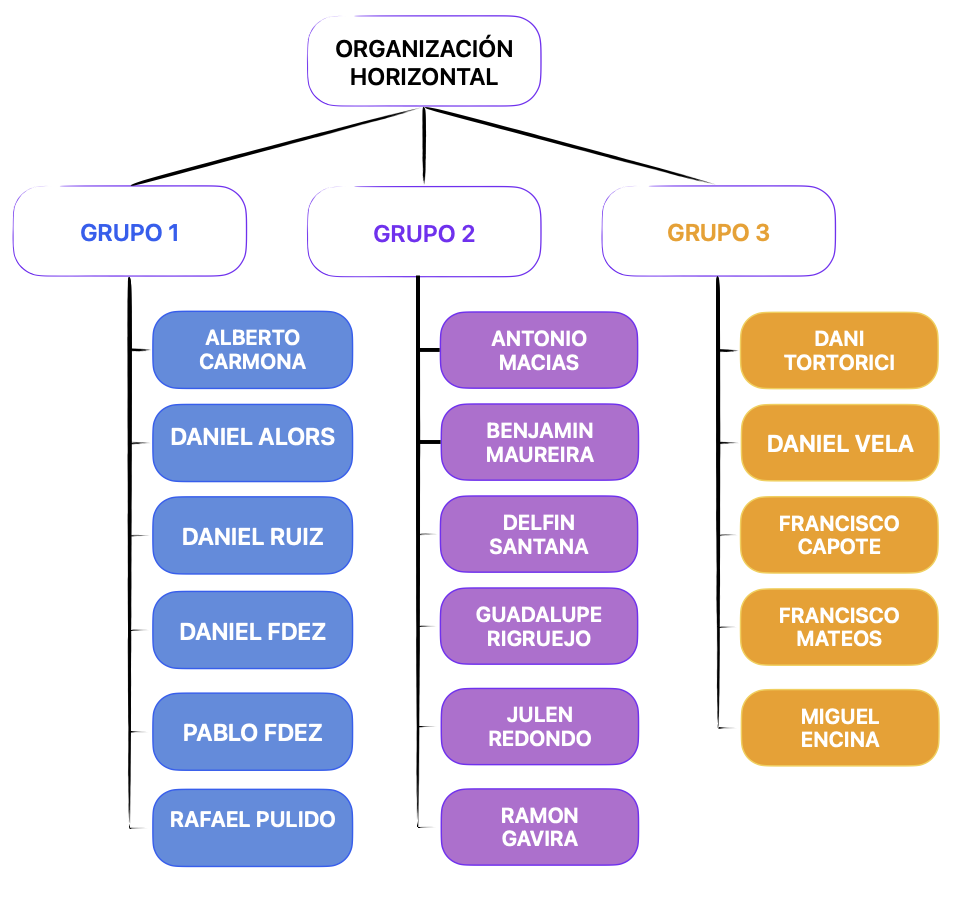

<!-- COMMENT THIS WHEN EXPORTING TO PDF -->

  

<h1 align="center" style="font-size: 30px; font-weight: bold;">
  FISIO FIND  -  PLAN DE GESTIÓN DE LOS RECURSOS HUMANOS
</h1>

 

**ÍNDICE**
- [**1. INTRODUCCIÓN**](#1-introducción)
- [**2. ROLES Y RESPONSABILIDADES**](#2-roles-y-responsabilidades)
  - [**2.1. ROLES DEL EQUIPO**](#21-roles-del-equipo)
- [**3. ORGANIGRAMA Y MATRIZ RACI**](#3-organigrama-y-matriz-raci)
  - [**3.1. ORGANIGRAMA DEL PROYECTO**](#31-organigrama-del-proyecto)
  - [**3.2. MATRIZ RACI**](#32-matriz-raci)
  - [**3.3. ESTRUCTURA DE DESGLOSE DE LOS RECURSOS HUMANOS**](#33-estructura-de-desglose-de-los-recursos-humanos)
- [**4. GESTIÓN DEL PERSONAL**](#4-gestión-del-personal)
  - [**4.1. Entrenamiento**](#41-entrenamiento)
  - [**4.2. Evaluación del Rendimiento**](#42-evaluación-del-rendimiento)
  - [**4.3. Reconocimientos y Recompensas**](#43-reconocimientos-y-recompensas)
<!-- COMMENT WHEN EXPORTING TO PDF -->

 

---

**Ficha del documento**

- **Nombre del Proyecto:** FISIO FIND

- **Número de Grupo:** Grupo 6

- **Entregable:** #DP

- **Miembros del grupo:** Alberto Carmona Sicre, Antonio Macías Ferrera, Benjamín Ignacio Maureira Flores, Francisco Capote García, Daniel Alors Romero, Daniel Fernández Caballero, Daniel Ruiz López, Daniel Tortorici Bartús, Daniel Vela Camacho, Delfín Santana Rubio, Guadalupe Ridruejo Pineda, Julen Redondo Pacheco, Miguel Encina Martínez, Francisco Mateos Villarejo, Pablo Fernández Pérez, Ramón Gavira Sánchez, Rafael Pulido Cifuentes.

- **Contribuidores:** Antonio Macías Ferrera (revisor), Daniel Fernández Caballero (autor)

- **Fecha de Creación:** 19/02/2025  

- **Versión:** v1.1

 

---

<!-- \newpage -->

**Historial de modificaciones**

| Fecha        | Versión | Realizada por              | Descripción de los cambios                              |
| ------------ | ------- | -------------------------- | ------------------------------------------------------- |
| 19/02/2025   | v1.0    | Daniel Fernández Caballero | Elaboración de la matriz RACI de responsabilidades.     |
| 19/02/2025   | v1.1    | Antonio Macías Ferrera     | Adición del resto de puntos del documento de acuerdo con el *Sprint Planning* general. |

 

<!-- \newpage -->

 

## **1. INTRODUCCIÓN**
Este documento describe la gestión de los recursos humanos del proyecto, en conformidad con el estándar PMBOK. Se definen los roles, responsabilidades y autoridad de cada miembro del equipo, se establece la asignación de tareas mediante una matriz RACI y se detallan los procesos de gestión del personal, incluyendo entrenamiento, evaluación del rendimiento y reconocimientos.

 

## **2. ROLES Y RESPONSABILIDADES**

Cada rol dentro del equipo tiene responsabilidades y niveles de autoridad específicos. A continuación, se describen los principales roles en el proyecto:

### **2.1. ROLES DEL EQUIPO**

| Rol                              | Responsabilidades                                                               | Autoridad                             | Habilidades requeridas                             |
| -------------------------------- | ------------------------------------------------------------------------------- | ------------------------------------- | -------------------------------------------------- |
| **Scrum Master**                 | Facilitar reuniones Scrum, gestionar impedimentos y asegurar cumplimiento ágil. | Alta autoridad en metodologías ágiles | Liderazgo, comunicación, gestión de conflictos.    |
| **Representantes de Grupo**      | Coordinar el equipo, elaborar planes de Sprint y comunicar avances.             | Coordinación de tareas del grupo      | Organización, comunicación, toma de decisiones.    |
| **Secretarios**                  | Registrar actas y feedback de reuniones.                                        | Moderada, documentación interna       | Atención al detalle, redacción, escucha activa.    |
| **Desarrolladores Frontend**     | Implementar la interfaz de usuario.                                             | Técnica en su área                    | React, CSS, UX/UI, JavaScript.                     |
| **Desarrolladores Backend**      | Implementar lógica de negocio y API.                                            | Técnica en su área                    | Python, Django, Bases de datos.                    |
| **Desarrolladores Fullstack**    | Integrar frontend y backend.                                                    | Técnica en su área                    | Desarrollo web completo, API REST.                 |
| **Equipo de QA**                 | Evaluar calidad del software y documentación.                                   | Técnica en estándares de calidad      | Testing, documentación, revisión de procesos.      |
| **Equipo de Planificación**      | Planificar tareas, documentar Scrum.                                            | Alta en asignación de tareas          | Organización, análisis de riesgos.                 |
| **Equipo de RRSS**    | Gestionar redes sociales y promoción.                                           | Moderada en comunicación externa      | Creatividad, redacción, gestión de redes sociales. |
| **Equipo de Presentaciones**     | Elaborar y exponer presentaciones del proyecto.                                 | Moderada en comunicación interna      | Comunicación, diseño gráfico, expresión oral.      |
| **Equipo de Formación**          | Capacitar en tecnologías y metodologías.                                        | Moderada, asesoramiento técnico       | Investigación, docencia, liderazgo.                |
| **Equipo de Informes IA**        | Elaborar reportes sobre IA aplicada en el proyecto.                             | Técnica en su área                    | Inteligencia Artificial, redacción técnica.        |
| **Equipo de Informes de Tiempo** | Elaborar informes sobre el uso del tiempo en el proyecto.                       | Técnica en su área                    | Análisis de datos, gestión del tiempo.             |

 

## **3. ORGANIGRAMA Y MATRIZ RACI**

### **3.1. ORGANIGRAMA DEL PROYECTO**

La organización del trabajo en este proyecto, debido al gran número de participantes, se ha estructurado de manera dual para asegurar una gestión eficiente y clara de las responsabilidades. Esta estructura dual se compone de una **división horizontal** y una **división transversal**.

***División Horizontal***

La **división horizontal** agrupa a los participantes en tres subgrupos. Cada subgrupo trabaja de manera autosuficiente durante la fase de ejecución del proyecto, lo que permite una mayor especialización y enfoque en tareas específicas. Cada subgrupo cuenta con un representante y un secretario, quienes tienen roles clave en la coordinación y documentación de las actividades del grupo.

- **Representantes**: Son responsables de facilitar la comunicación dentro del grupo y con otros subgrupos. Además, se encargan de elaborar los planes de Sprint y dividir las tareas entre los miembros del grupo.

- **Secretarios**: Se encargan de registrar las actas de las reuniones internas y tomar nota del feedback recibido de los profesores y otros stakeholders.

La **organización horizontal** está compuesta por tres grupos de trabajo, en los que cada uno tiene un representante y un secretario.

| GRUPO 1                                 | GRUPO 2                               | GRUPO 3                                |
| --------------------------------------- | ------------------------------------- | -------------------------------------- |
| ALBERTO CARMONA SICRE (secretario)      | ANTONIO MACÍAS FERRERA (Scrum Master) | DANIEL TORTORICI BARTUS                |
| DANIEL ALORS ROMERO                     | BENJAMÍN I. MAUREIRA FLORES           | DANIEL VELA CAMACHO (secretario)       |
| DANIEL FERNÁNDEZ CABALLERO              | DELFÍN SANTANA RUBIO (secretario)     | FRANCISCO CAPOTE GARCÍA                |
| DANIEL RUIZ LÓPEZ                       | GUADALUPE RIDRUEJO PINEDA             | Francisco Mateos Villarejo             |
| PABLO FERNÁNDEZ PÉREZ                   | JULEN REDONDO PACHECO                 | MIGUEL ENCINA MARTÍNEZ (representante) |
| RAFAEL PULIDO CIFUENTES (representante) | RAMÓN GAVIRA SÁNCHEZ (representante)  |                                        |

Estos grupos trabajarán de forma autosuficiente durante la fase de ejecución (desarrollo del producto). 

***División Transversal***

La **división transversal** asigna roles específicos a los miembros del equipo para tareas que trascienden el desarrollo de la aplicación. Estos roles incluyen planificación, documentación, publicidad, y otras actividades esenciales para el éxito del proyecto. Los equipos transversales están formados por miembros de los diferentes subgrupos horizontales, lo que fomenta la colaboración y el intercambio de conocimientos entre los distintos grupos.

- **Equipo de redes sociales y publicidad**: encargados de todo aquello relacionado con las redes sociales, promoción, publicidad y comunicaciones externas del proyecto (dentro de estas comunicaciones externas entra el contacto con Usuarios Piloto).

- **Equipo de Planificación**: encargados de la planificación de tareas y asignación por grupos, encargados también de la elaboración de la documentación Scrum (planning, review, retrospective...). El equipo de planificación estará formado por los representantes de cada grupo, además del *Scrum Master*.

- **Equipo de Secretarios**: encargados de elaborar las actas de reuniones de cada grupo y tomar nota del feedback de cada clase. El equipo estará formado por los secretarios de cada grupo.

- **Equipo de Quality Assurance**: encargados de evaluar la calidad del desarrollo, documentación, planificación y desempeño del equipo y comunicar semanalmente sus conclusiones.

 

- **Encargados de Presentaciones y Diseño**: encargados de diseñar y crear las presentaciones y exponerlas.

- **Encargados de formación**: encargados de investigar sobre las tecnologías a usar, planificar y ejecutar la formación del equipo.

- **Encargados de informes de tiempo**: encargados de elaborar informes semanales de tiempo.

- **Encargados de informes de Inteligencia Artificial**: encargados de elaborar informes semanales sobre el uso de la Inteligencia Artificial.

| RRSS Y PUBLICIDAD  | PLANIFICACIÓN      | SECRETARIOS     | QA                   |
| ------------------ | ------------------ | --------------- | -------------------- |
| ANTONIO MACÍAS     | ANTONIO MACÍAS     | ALBERTO CARMONA | BENJAMÍN I. MAUREIRA |
| FRANCISCO CAPOTE   | GUADALUPE RIDRUEJO | DANIEL VELA     | DANIEL ALORS         |
| FRANCISCO MATEOS   | MIGUEL ENCINA      | DELFÍN SANTANA  | FRANCISCO MATEOS     |
| GUADALUPE RIDRUEJO | PABLO FERNÁNDEZ    |                 | MIGUEL ENCINA        |
| PABLO FERNÁNDEZ    | RAFAEL PULIDO      |                 |                      |
| RAFAEL PULIDO      | RAMÓN GAVIRA       |                 |                      |
| DANIEL RUIZ        |                    |                 |                      |

 

| PRESENTACIONES     | TIEMPO          | IA               | FORMACIÓN     |
| ------------------ | --------------- | ---------------- | ------------- |
| ANTONIO MACÍAS     | ALBERTO CARMONA | DANIEL FERNÁNDEZ | RAFAEL PULIDO |
| GUADALUPE RIDRUEJO | RAFAEL PULIDO   | DANIEL RUIZ      | RAMÓN GAVIRA  |
|                    |                 |                  |               |

Así, las tareas se podrán asignar a equipos siguiendo alguno de los dos tipos de subdivisiones explicados. Sin embargo, dado que seguimos una organización ágil, esta organización se podrá modificar en cualquier momento. Por ejemplo, si se sabe que hay dos personas que son idóneas para hacer una tarea, se podrá asignar a esas dos personas a hacerla. También, si por ejemplo el equipo de QA o de seguimiento han terminado sus tareas, podrán ayudar en cualquier otra tarea.

### **3.2. MATRIZ RACI**

| *Miembro del Equipo*             | RRSS y Publicidad | Planificación | Secretaría | QA  | Presentaciones | Informe de Tiempo | Informe de IA | Frontend | Backend |
| -------------------------------- | ----------------- | ------------- | ---------- | --- | -------------- | ----------------- | ------------- | -------- | ------- |
| Rafael Pulido Cifuentes          | X                 | X             | -          | -   | -              | X                 | -             | X        | -       |
| Daniel Ruiz López                | X                 | -             | -          | -   | -              | -                 | X             | X        | -       |
| Alberto Carmona Sicre            | -                 | -             | X          | -   | -              | X                 | -             | -        | X       |
| Daniel Fernández Caballero       | -                 | -             | -          | -   | -              | -                 | X             | -        | X       |
| Daniel Alors Romero              | -                 | -             | -          | X   | -              | -                 | -             | -        | X       |
| Pablo Fernández Pérez            | X                 | X             | -          | -   | -              | -                 | -             | X        | X       |
| Julen Redondo Pacheco            | -                 | -             | -          | -   | -              | -                 | -             | X        | -       |
| Benjamín Ignacio Maureira Flores | -                 | -             | -          | X   | -              | -                 | -             | X        | -       |
| Delfín Santana Rubio             | -                 | -             | X          | -   | -              | -                 | -             | -        | X       |
| Guadalupe Ridruejo Pineda        | X                 | X             | -          | -   | X              | -                 | -             | -        | X       |
| Antonio Macías Ferrera           | X                 | X             | -          | -   | X              | -                 | -             | -        | X       |
| Ramón Gavira Sánchez             | -                 | X             | -          | -   | -              | -                 | -             | X        | X       |
| Daniel Vela Camacho              | -                 | -             | X          | -   | -              | -                 | -             | X        | -       |
| Daniel Tortorici Bartús          | -                 | -             | -          | -   | -              | -                 | -             | X        | -       |
| Francisco Mateos Villarejo       | X                 | -             | -          | X   | -              | -                 | -             | -        | X       |
| Francisco Capote García          | X                 | -             | -          | -   | -              | -                 | -             | -        | X       |
| Miguel Encina Martínez           | -                 | X             | -          | X   | -              | -                 | -             | X        | X       |

<!-- COMMENT WHEN EXPORTING TO PDF -->
| *Miembro del Equipo*             | *RRSS y Publicidad* | *Planificación* | *Secretaría* | *QA* | *Presentaciones* | *Informe de Tiempo* | *Informe de IA* | *Frontend* | *Backend* |
| -------------------------------- | ------------------- | --------------- | ------------ | ---- | ---------------- | ------------------- | --------------- | ---------- | --------- |
| Rafael Pulido Cifuentes          | 🟩                   | 🟩               | ⬜            | ⬜    | ⬜                | 🟩                   | ⬜               | 🟦          | ⬜         |
| Daniel Ruiz López                | 🟩                   | ⬜               | ⬜            | ⬜    | ⬜                | ⬜                   | 🟩               | 🟦          | ⬜         |
| Alberto Carmona Sicre            | ⬜                   | ⬜               | 🟩            | ⬜    | ⬜                | 🟩                   | ⬜               | ⬜          | 🟦         |
| Daniel Fernández Caballero       | ⬜                   | ⬜               | ⬜            | ⬜    | ⬜                | ⬜                   | 🟩               | ⬜          | 🟦         |
| Daniel Alors Romero              | ⬜                   | ⬜               | ⬜            | 🟩    | ⬜                | ⬜                   | ⬜               | ⬜          | 🟦         |
| Pablo Fernández Pérez            | 🟩                   | 🟩               | ⬜            | ⬜    | ⬜                | ⬜                   | ⬜               | 🟦          | 🟦         |
| Julen Redondo Pacheco            | ⬜                   | ⬜               | ⬜            | ⬜    | ⬜                | ⬜                   | ⬜               | 🟦          | ⬜         |
| Benjamín Ignacio Maureira Flores | ⬜                   | ⬜               | ⬜            | 🟩    | ⬜                | ⬜                   | ⬜               | 🟦          | ⬜         |
| Delfín Santana Rubio             | ⬜                   | ⬜               | 🟩            | ⬜    | ⬜                | ⬜                   | ⬜               | ⬜          | 🟦         |
| Guadalupe Ridruejo Pineda        | 🟩                   | 🟩               | ⬜            | ⬜    | 🟩                | ⬜                   | ⬜               | ⬜          | 🟦         |
| Antonio Macías Ferrera           | 🟩                   | 🟩               | ⬜            | ⬜    | 🟩                | ⬜                   | ⬜               | ⬜          | 🟦         |
| Ramón Gavira Sánchez             | ⬜                   | 🟩               | ⬜            | ⬜    | ⬜                | ⬜                   | ⬜               | 🟦          | 🟦         |
| Daniel Vela Camacho              | ⬜                   | ⬜               | 🟩            | ⬜    | ⬜                | ⬜                   | ⬜               | 🟦          | ⬜         |
| Daniel Tortorici Bartús          | ⬜                   | ⬜               | ⬜            | ⬜    | ⬜                | ⬜                   | ⬜               | 🟦          | ⬜         |
| Francisco Mateos Villarejo       | 🟩                   | ⬜               | ⬜            | 🟩    | ⬜                | ⬜                   | ⬜               | ⬜          | 🟦         |
| Francisco Capote García          | 🟩                   | ⬜               | ⬜            | ⬜    | ⬜                | ⬜                   | ⬜               | ⬜          | 🟦         |
| Miguel Encina Martínez           | ⬜                   | 🟩               | ⬜            | 🟩    | ⬜                | ⬜                   | ⬜               | 🟦          | 🟦         |

Leyenda: 🟦 Frontend; 🟩 Backend.
<!-- COMMENT WHEN EXPORTING TO PDF -->

### **3.3. ESTRUCTURA DE DESGLOSE DE LOS RECURSOS HUMANOS**

 

 

## **4. GESTIÓN DEL PERSONAL**

### **4.1. Entrenamiento**
Se establece un plan de formación para garantizar el aprendizaje de las herramientas utilizadas en el proyecto:
- Talleres sobre Git y GitHub.
- Formación en metodologías ágiles.
- Capacitación en tecnologías de desarrollo (React, Django, etc.).
- Sesiones sobre buenas prácticas de documentación y pruebas.

### **4.2. Evaluación del Rendimiento**
El rendimiento del equipo será evaluado de forma semanal a través de:
- *Revisiones retrospectivas* en cada Sprint.
- Evaluaciones internas del equipo de QA.
- Feedback cruzado entre miembros del equipo.

### **4.3. Reconocimientos y Recompensas**
Para fomentar la motivación del equipo, se implementarán las siguientes estrategias de reconocimiento:
- Destacar los logros en reuniones de Sprint Review.
- Certificados de reconocimiento a los miembros más destacados.
- Incentivos académicos o profesionales (ej. menciones en LinkedIn, cartas de recomendación).

