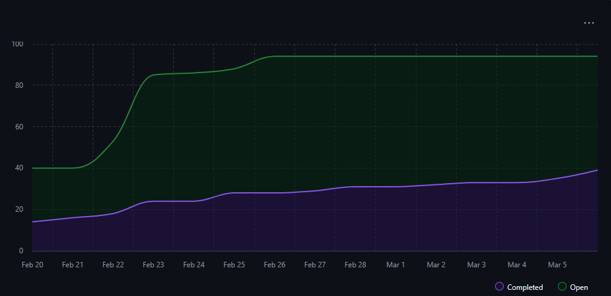

<!-- COMMENT THIS WHEN EXPORTING TO PDF -->

  

<h1 align="center" style="font-size: 30px; font-weight: bold;">
  REPORTE ANÁLISIS CUANTITATIVO DE LA CALIDAD SPRINT 1 (21/02/25) - (06/03/25)
</h1>

**ÍNDICE**
- [1. INTRODUCCIÓN](#1-introducción)
- [2. MÉTRICAS DE DESARROLLO](#2-métricas-de-desarrollo)
  - [2.1. NÚMERO DE COMMITS](#21-número-de-commits)
    - [2.1.1. NÚMERO DE COMMITS POR PERSONA](#211-número-de-commits-por-persona)
  - [2.2. NÚMERO DE PULL REQUESTS](#22-número-de-pull-requests)
- [3. INFORME DE TIEMPO](#3-informe-de-tiempo)
- [4. ANÁLISIS DE TAREAS REALIZADAS](#4-análisis-de-tareas-realizadas)
  - [4.1. GRÁFICA BURN UP](#41-gráfica-burn-up)
- [5. ANÁLISIS DE COMUNICACIONES](#5-análisis-de-comunicaciones)
    - [Respeto de horarios de comunicación](#respeto-de-horarios-de-comunicación)
    - [Uso de canales/grupos adecuados](#uso-de-canalesgrupos-adecuados)
    - [Ratio de respuestas en canales oficiales](#ratio-de-respuestas-en-canales-oficiales)
    - [Observaciones generales](#observaciones-generales)
- [6. USO DE INTELIGENCIA ARTIFICIAL](#6-uso-de-inteligencia-artificial)

<!-- COMMENT WHEN EXPORTING TO PDF -->

 

**Ficha del documento**

- **Nombre del Proyecto:** FISIO FIND

- **Número de Grupo:** Grupo 6

- **Entregable:** #SPRINT 1

- **Miembros del grupo:** Alberto Carmona Sicre, Antonio Macías Ferrera, Benjamín Ignacio Maureira Flores, Francisco Capote García, Daniel Alors Romero, Daniel Fernández Caballero, Daniel Ruiz López, Daniel Tortorici Bartús, Daniel Vela Camacho, Delfín Santana Rubio, Guadalupe Ridruejo Pineda, Julen Redondo Pacheco, Miguel Encina Martínez, Francisco Mateos Villarejo, Pablo Fernández Pérez, Ramón Gavira Sánchez, Rafael Pulido Cifuentes.

- **Contribuidores:** [Daniel Alors Romero](https://github.com/DanielAlors) (autor), [Benjamín Ignacio Maureira Flores](https://github.com/benjimrfl) (autor), [Miguel Encina Martínez](https://github.com/MiguelEncina) (revisor), [Francisco Mateos Villarejo](https://github.com/pacomateos10) (autor)

- **Fecha de Creación:** 04/03/2025  

- **Versión:** v1.1

 

---

**Histórico de Modificaciones**

| Fecha      | Versión | Realizada por   | Descripción de los cambios                       |
| ---------- | ------- | --------------- | ------------------------------------------------ |
| 04/03/2025 | v1.0    | Francisco Mateos Villarejo, Daniel Alors Romero | Elaboración de la estructura del documento para su posterior realización el día 06. |
| 06/03/2025 | v1.1    | Francisco Mateos Villarejo, Daniel Alors Romero, Miguel Encina Martínez, Benjamín Ignacio Maureira Flores | Compleción del documento

 

<!-- \newpage -->

 

# 1. INTRODUCCIÓN
El presente informe tiene como objetivo analizar de manera cuantitativa la calidad del trabajo realizado durante las primeras dos semanas del Sprint 1, proporcionando métricas clave que reflejan el desempeño del equipo de desarrollo. Este análisis es fundamental para evaluar la eficiencia del equipo, detectar posibles áreas de mejora y garantizar el cumplimiento de los objetivos establecidos en esta fase del proyecto.

A lo largo del documento, se presentan estadísticas relacionadas con la actividad en el repositorio, incluyendo el número de commits y pull requests generados. Asimismo, se examina el uso del tiempo por parte del equipo, considerando datos proporcionados por el equipo de control de tiempo, y se realiza un estudio sobre el progreso de las tareas en función de los reportes de GitHub Project y las gráficas Burn Down.

Otro aspecto clave del análisis es el estudio de la comunicación dentro del equipo, con el fin de evaluar el respeto a los horarios establecidos, el uso adecuado de los distintos canales y la efectividad en la interacción entre los miembros del equipo. Finalmente, se revisa el uso de herramientas de inteligencia artificial en el desarrollo, con el fin de medir su impacto en la productividad y en la calidad del trabajo realizado.

Este informe servirá como base para futuras iteraciones, permitiendo la identificación de patrones y la implementación de estrategias que optimicen el desarrollo del proyecto.

# 2. MÉTRICAS DE DESARROLLO
El análisis cuantitativo del desarrollo es esencial para evaluar la productividad del equipo y el progreso del proyecto. En esta sección, se presentan indicadores clave como el número de commits y pull requests (PRs) generados en el repositorio. Estas métricas permiten medir la frecuencia de contribuciones individuales y colectivas, así como la eficiencia en la integración de código.

Los commits reflejan el nivel de actividad en el desarrollo, permitiendo identificar tendencias de trabajo, detectar posibles cuellos de botella y evaluar la distribución del esfuerzo entre los miembros del equipo. Por otro lado, el número de PRs creados y fusionados proporciona una visión sobre la colaboración y revisión de código, lo que es crucial para garantizar la calidad y estabilidad del software.

A continuación, se presentan los datos recopilados durante este período.

## 2.1. NÚMERO DE COMMITS
El número de commits que se van a evaluar son los mergeados a la rama de Develop, sabiendo que no son los únicos realizados durante la semana, se contabilizará el número total de commits y su comparativa con los realizados en la anterior semana.
Commits totales: 236
Commits Semanales: Al ser esta la primera vez que se contabilicen se considerarán como iguales los totales y semanales.

### 2.1.1. NÚMERO DE COMMITS POR PERSONA
Alberto Carmona Sicre: 10
Antonio Macías Ferrera: 35
Benjamín Ignacio Maureira Flores: 2
Francisco Capote García: 1
Daniel Alors Romero: 7
Daniel Fernández Caballero: 15
Daniel Ruiz López: 19
Daniel Tortorici Bartús: 5
Daniel Vela Camacho: 11
Delfín Santana Rubio: 59
Guadalupe Ridruejo Pineda: 6 
Julen Redondo Pacheco: 4
Miguel Encina Martínez: 12
Francisco Mateos Villarejo: 4 
Pablo Fernández Pérez: 1
Ramón Gavira Sánchez: 6
Rafael Pulido Cifuentes: 39

## 2.2. NÚMERO DE PULL REQUESTS
El número de Pull Requests que se van a evaluar son las mergeadas a la rama de Develop, sabiendo que no son los únicas realizadas durante la semana, se contabilizará el número total de Pull Requests realizadas en el proyecto y su comparativa con las realizadas en la anterior semana.
Pull Requests totales: 63
Pull Requests Semanales: Al ser esta la primera vez que se contabilicen se considerarán como iguales los totales y semanales.

# 3. INFORME DE TIEMPO
El análisis del tiempo de trabajo es un factor clave en la evaluación de la productividad y eficiencia del equipo. En esta sección, se presentan datos recopilados por el equipo de control de tiempo, los cuales permiten medir el desempeño en función de las horas trabajadas, el cumplimiento de los planes establecidos y las posibles desviaciones respecto a la planificación inicial.

Este análisis ayuda a identificar patrones en la distribución del tiempo, evaluar la carga de trabajo y detectar oportunidades de mejora en la gestión del tiempo dentro del Sprint. Además, proporciona información valiosa para la planificación de futuras iteraciones y la optimización del flujo de trabajo del equipo.

Fuente: Datos proporcionados por el equipo de control de tiempo en los reportes "time_report_week_4" y "time_report_week_5" en la carpeta "03_reports/time_reports".

# 4. ANÁLISIS DE TAREAS REALIZADAS
El análisis de las tareas realizadas es fundamental para evaluar el avance del Sprint y la eficiencia del equipo en la ejecución de las actividades planificadas. A través de la recopilación de datos en herramientas como GitHub Project y el uso de gráficas Burn Down, se obtiene una visión clara sobre el ritmo de trabajo y la capacidad del equipo para completar las tareas asignadas dentro de los plazos establecidos.

Este estudio permite identificar posibles bloqueos en el desarrollo, evaluar la distribución del trabajo entre los miembros del equipo y detectar tendencias que puedan afectar la entrega del producto. Asimismo, proporciona información clave para mejorar la planificación en futuras iteraciones, optimizando la asignación de recursos y estableciendo estrategias más efectivas de gestión del flujo de trabajo.

Fuente: GitHub Project, gráficas Burn Down.

## 4.1. GRÁFICA BURN UP

Como podemos observar, hay un avance progresivo de las tareas durante estas primeras semanas de trabajo, lo que indica que el equipo está trabajando diariamente de forma equitativa. Sin embargo, si se quiere completar con todas las tareas planificadas para este primer Sprint, va a ser necesario incrementar la productividad y el esfuerzo dedicado. Aún así, cabe destacar que esta gráfica no representa el progreso de las tareas no finalizadas, por lo que no podemos profundizar más en el análisis.

# 5. ANÁLISIS DE COMUNICACIONES
La comunicación efectiva es un pilar fundamental en el éxito del equipo de desarrollo. En esta sección, se evalúa el respeto a los horarios establecidos, el uso correcto de los canales de comunicación y la eficiencia en la interacción entre los miembros del equipo. Un flujo de comunicación adecuado permite la resolución rápida de bloqueos, mejora la coordinación del trabajo y evita malentendidos.

El análisis de la comunicación incluye métricas como la frecuencia de uso de los distintos canales, el tiempo de respuesta a consultas y la adherencia a las mejores prácticas establecidas para el trabajo en equipo. Además, se busca identificar posibles mejoras en la dinámica comunicativa para optimizar la productividad y la cohesión del equipo.

### Respeto de horarios de comunicación
El horario de comunicación se ha respetado por parte de todos los integrantes del grupo. Este horario viene definido en el Commitment Agreement, y todos los integrantes han estado disponibles dentro de ese periodo. 

### Uso de canales/grupos adecuados
Para la comunicación entre los miembros de cada grupo, se han respetado los canales disponibles definidos en el Plan de Gestión de las Comunicaciones. Cada grupo se ha reunido por Discord o por Teams, y la comunicación entre grupos se ha realizado mediante los representantes de cada uno.

### Ratio de respuestas en canales oficiales
Las respuestas se han realizado de la forma más rápida y eficaz posible: se ha creado un grupo de WhatsApp dentro de la comunidad creada para aclarar dudas rápidas. Si alguien tiene una duda rápida, la explica de la forma más detallada posible. El primer miembro que lea dicha pregunta y la sepa responder responderá. De esta forma, se evita que las dudas se pierdan por el chat ya que funciona con la forma pregunta-respuesta.

### Observaciones generales
El equipo está siguiendo el Plan de Gestión de Comunicaciones y el Commitment Agreement, no produciéndose problemas y respetando los tiempos de disponibilidad. El clima y ritmo de trabajo son favorables gracias a esto.

# 6. USO DE INTELIGENCIA ARTIFICIAL
El uso de herramientas de inteligencia artificial en el desarrollo de software ha cobrado una relevancia creciente en los últimos años. En esta sección, se analiza el impacto del uso de IA dentro del equipo, considerando su aplicación en diversas tareas como generación de código, documentación, pruebas y automatización de procesos repetitivos.

Este análisis busca evaluar cómo la inteligencia artificial ha influido en la productividad del equipo, si ha permitido reducir tiempos de desarrollo y si ha presentado algún desafío en su implementación. También se revisa el cumplimiento de buenas prácticas en su uso, garantizando que la IA se utilice como un complemento eficaz dentro del flujo de trabajo del equipo.

Fuente: Datos proporcionados por el equipo de control de uso de IA en el documento "ia_report_week_4-5" en la carpeta "03_reports/ia_reports".

---