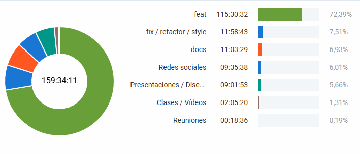

<!-- COMMENT THIS WHEN EXPORTING TO PDF -->

  

<h1 align="center" style="font-size: 30px; font-weight: bold;">
  FISIO FIND  -  INFORME DE TIEMPO 28/02-06/03
</h1>

 

**ÍNDICE**
1. [PROYECTOS](#1-proyectos)  
    1.1 [DEFINICIÓN DE CADA PROYECTO](#11-definición-de-cada-proyecto)  
    1.2 [PROYECTOS REALIZADOS EN LA SEMANA](#12-proyectos-realizados-en-la-semana)  
    1.3 [PROYECTOS DESTACADOS](#13-proyectos-destacados)  
2. [HORAS TOTALES](#2-horas-totales)
3. [DESGLOSE](#3-desglose)  
    3.1 [DESGLOSE POR DÍAS](#31-desglose-por-días)  
    3.2 [DESGLOSE POR PROYECTOS](#32-desglose-por-proyectos)  
    3.3 [DESGLOSE POR INTEGRANTES](#33-desglose-por-integrantes)
<!-- COMMENT WHEN EXPORTING TO PDF -->

 

---

**Ficha del documento**

- **Nombre del Proyecto:** FISIO FIND

- **Número de Grupo:** Grupo 6

- **Entregable:** #S1

- **Miembros del grupo:** Alberto Carmona Sicre, Antonio Macías Ferrera, Benjamín Ignacio Maureira Flores, Francisco Capote García, Daniel Alors Romero, Daniel Fernández Caballero, Daniel Ruiz López, Daniel Tortorici Bartús, Daniel Vela Camacho, Delfín Santana Rubio, Guadalupe Ridruejo Pineda, Julen Redondo Pacheco, Miguel Encina Martínez, Francisco Mateos Villarejo, Pablo Fernández Pérez, Ramón Gavira Sánchez, Rafael Pulido Cifuentes.

- **Autores:** Alberto Carmona Sicre

- **Fecha de Creación:** 06/03/2025  

- **Versión:** v1.0

 

---

<!-- \newpage -->

**Histórico de Modificaciones**

| Fecha      | Versión | Realizada por                    | Descripción de los cambios |
|------------|---------|----------------------------------|----------------------------|
| 06/03/2025 | v1.0    | Alberto Carmona Sicre            | Elaboración de la primera versión del documento de informe de tiempo de la semana 5 |

 

<!-- \newpage -->

 

# 1. PROYECTOS

**IMPORTANTE: LAS HORAS SE HAN CALCULADO HASTA LAS 14:30 DEL DÍA 06/03/2025**  

## 1.1. Definición de cada proyecto
A continuación, se muestran los posibles tipos de tareas en las que pueden trabajar los integrantes del equipo, junto con una breve definición de estas:

- **Clases / Vídeos:** aquellas horas que corresponden a acudir a las clases presenciales de la asignatura, así como ver los vídeos que se ofrecen como contenido.

- **feat:** tanto este proyecto como los tres siguientes se referirán a tareas que requieran desarrollo de código en el repositorio. En concreto, este proyecto abarca aquellas tareas que se relacionen con el desarrollo de código y nuevas funcionalidades.

- **docs:** todo lo relacionado con la realización de los diferentes documentos que se redactarán a lo largo del proyecto.

- **fix / refactor / style:** en este apartado entra: corrección de código erróneo, refactorización del código y estilos de visualización de la aplicación.

- **test:** tipo de tarea para realizar las pruebas correspondientes tras la integración de nuevas funcionalidades que se crean terminadas.  

- **Planificación:** todo lo relacionado con la planificación del proyecto.  

- **Presentaciones / Diseños:** todo lo relacionado con preparar las presentaciones semanales de la asignatura o elaborar los diseños de la aplicación tales como logos, portadas, etc.  

- **Redes sociales:** para aquellas tareas relacionadas con la gestión de las redes sociales, posicionamiento y publicidad del proyecto.  

- **Reuniones:** como su nombre indica, son aquellas tareas en las que se invierte el tiempo en reuniones del equipo de carácter general.  

## 1.2. Proyectos realizados en la semana
En esta semana de trabajo se ha trabajado en los siguientes proyectos:  

1. docs  

2. Presentaciones / Diseños  

3. Reuniones  

4. Clases / Vídeos   

5. feat  

6. fix/refactor/style  

7. Redes sociales  

## 1.3. Proyectos destacados
Entre los proyectos destacados de la semana, aquellos en los que se ha invertido más tiempo, encontramos el siguiente, que cuenta con hasta 10 veces más horas que el segundo:  

- **feat:** 115:30:32	

 

# 2. HORAS TOTALES
Para esta semana de trabajo, el tiempo total dedicado al proyecto ha sido de 159 horas y 15 minutos.
  

 

# 3. DESGLOSE
Para una mejor visualización del tiempo dedicado, se realiza un desglose por días, proyectos e integrantes. 

## 3.1 Desglose por días  
Ordenado de manera cronológica:

- **Viernes 28/02:** 13:35:09  

- **Sábado 01/03:** 02:23:48  

- **Domingo 02/03:** 08:46:05  

- **Lunes 03/03:** 36:56:21  

- **Martes 04/03:** 27:08:31  

- **Miércoles 05/03:** 48:26:56  

- **Jueves 06/03:** 21:58:00    

 

## 3.2 Desglose por proyectos  
Ordenado de mayor a menor tiempo dedicado en cada proyecto: 

**1. feat:** 115:30:32    	

**2. fix / refactor / style:** 11:58:43  

**3. docs:** 10:44:08  

**4. Redes sociales:** 09:35:38  

**5. Presentaciones / Diseños:** 09:01:53

**6. Clases / Vídeos:** 02:05:20  

**7. Reuniones:** 00:18:36   

**8. Planificación:** hh:mm    

**9. test:** hh:mm  	 

Diagrama de sectores para una mejor visualización de la división:

 

## 3.3 Desglose por integrantes

Ordenado por orden alfabético:

**1. Alberto Carmona Sicre** - 10:27:18

**2. Antonio Macías Ferrera** -  11:51:25

**3. Benjamín Ignacio Maureira Flores** -  10:37:31

**4. Daniel Alors Romero** - 10:34:25

**5. Daniel Fernández Caballero** - 10:24:00

**6. Daniel Ruiz López**  -  09:20:44

**7. Daniel Tortorici Bartús** - 10:35:55

**8. Daniel Vela Camacho** - 06:08:55

**9. Delfín Santana Rubio** - 10:37:01

**10. Francisco Capote García** -  09:26:29

**11. Francisco Mateos Villarejo** -  07:32:08

**12. Guadalupe Ridruejo Pineda** - 07:47:59

**13. Julen Redondo Pacheco** -  09:20:38

**14. Miguel Encina Martínez** -  07:19:49

**15. Pablo Fernández Pérez** -  10:08:21

**16. Ramón Gavira Sánchez**  -  10:18:02

**17. Rafael Pulido Cifuentes** -  06:44:10

Diagrama de sectores para una mejor visualización:

  

 

---

**Aprobado por:**  
**Scrum Master:** Antonio Macías Ferrera