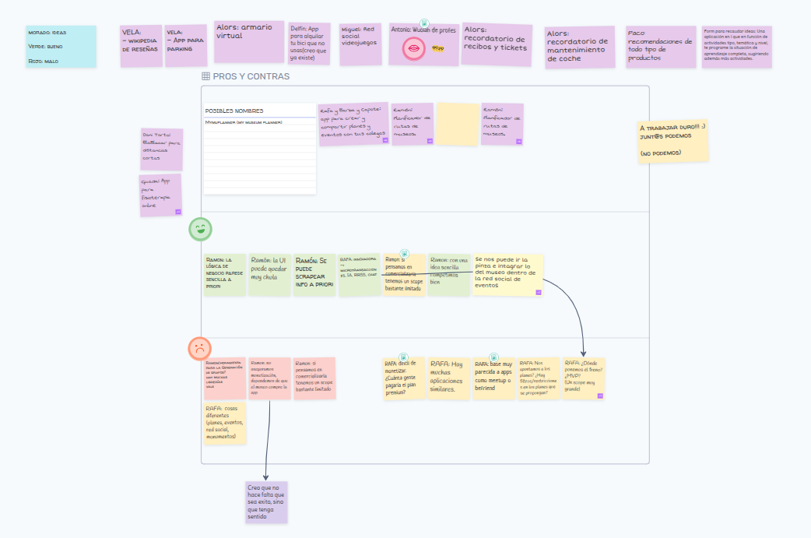

<!-- COMMENT THIS WHEN EXPORTING TO PDF -->

  

<h1 align="center" style="font-size: 30px; font-weight: bold;">
  FISIO FIND - REUNIÓN 03-02-2025
</h1>

 

**ÍNDICE**
- [**1. OBJETIVO DE LA REUNIÓN**](#1-objetivo-de-la-reunión)
- [**2. ORDEN DEL DÍA**](#2-orden-del-día)
- [**3. ACUERDOS Y DECISIONES**](#3-acuerdos-y-decisiones)
- [**4. CONCLUSIONES Y OBSERVACIONES**](#4-conclusiones-y-observaciones)
<!-- COMMENT WHEN EXPORTING TO PDF -->

 

---

**Ficha del documento**

- **Nombre del Proyecto:** FISIO FIND

- **Número de Grupo:** Grupo 6

- **Entregable:** #DP (autor)

- **Miembros del grupo:** Alberto Carmona Sicre, Antonio Macías Ferrera, Benjamín Ignacio Maureira Flores, Francisco Capote García, Daniel Alors Romero, Daniel Fernández Caballero, Daniel Ruiz López, Daniel Tortorici Bartús, Daniel Vela Camacho, Delfín Santana Rubio, Guadalupe Ridruejo Pineda, Julen Redondo Pacheco, Miguel Encina Martínez, Francisco Mateos Villarejo, Pablo Fernández Pérez, Ramón Gavira Sánchez, Rafael Pulido Cifuentes.

- **Contribuidores:** Antonio Macías Ferrera (autor)

- **Fecha de Creación:** 03/02/2025  

- **Versión:** v1.0

 

---

**Histórico de Modificaciones**

| Fecha      | Versión | Realizada por                    | Descripción de los cambios |
|------------|---------|----------------------------------|----------------------------|
| 03/02/2025 | v1.0    | Antonio Macías Ferrera           | Elaboración del acta de reunión. |

 

---

**Participantes**

| Nombre completo | Rol | Contacto |
|----------------|-----|----------|
| Alberto Carmona Sicre | -- | albcarsic@alum.us.es |
| Antonio Macías Ferrera | -- | antmacfer1@alum.us.es |
| Benjamín Ignacio Maureira Flores | -- | benmauflo@alum.us.es |
| Francisco Capote García | -- | fracapgar1@alum.us.es |
| Daniel Alors Romero | -- | danalorom1@alum.us.es |
| Daniel Fernández Caballero | -- | danfercab@alum.us.es |
| Daniel Ruiz López | -- | danruilop1@alum.us.es |
| Daniel Tortorici Bartús | -- | dantorbar1@alum.us.es |
| Daniel Vela Camacho | -- | danvelcam@alum.us.es |
| Delfín Santana Rubio | -- | delsanrub@alum.us.es |
| Guadalupe Ridruejo Pineda | -- | guaridpin@alum.us.es |
| Julen Redondo Pacheco | -- | julredpac@alum.us.es |
| Miguel Encina Martínez | -- | migencmar@alum.us.es |
| Francisco Mateos Villarejo | -- | framatvil@alum.us.es |
| Pablo Fernández Pérez | -- | pablofp.33@gmail.com |
| Ramón Gavira Sánchez | -- | ramgavsan@alum.us.es |
| Rafael Pulido Cifuentes | -- | rafpulcif@alum.us.es |

 

<!-- \newpage -->

 

# **1. OBJETIVO DE LA REUNIÓN**

En esta primera reunión para el proyecto de la asignatura **Ingeniería del Software en la Práctica Profesional (ISPP)** se abordará el primer objetivo propuesto por el profesorado de la asignatura, que consistirá en darle forma a la propuesta de proyecto. Para ello, se establece el siguiente orden del día:

 

 

# **2. ORDEN DEL DÍA**

- ✅ **Tema 1:** Presentación de cada una de las propuestas haciendo uso de metro-retro [[link](https://metroretro.io/BOIOZAZIA0Z8)].
- ✅ **Tema 2:** Elección de propuesta.
- ✅ **Tema 3:** Elección de nombre para el proyecto (brainstorming).
- ✅ **Tema 4:** Asignación de roles de acuerdo con el formulario [[link](https://forms.office.com/Pages/ResponsePage.aspx?id=TmhK77WBHEmpjsezG-bEaVgwChHdlA5NsL3NLOJGx-NUOVI2WldLNjBRUEJCNUpISkMwRU1ITFJVQy4u)].
- ✅ **Tema 5:** Asignación de tareas hasta la próxima clase del viernes.

 

 

# **3. ACUERDOS Y DECISIONES**

| Tema | Decisión |
|------|----------|
| Tema 1 | Se presentaron varias propuestas por parte de algunos de los miembros que procedieron a explicar cada una de ellas. Consultar pizarra para más detalles [Figura 1] |
| Tema 2 | Tras la presentación de todas las propuestas, se hizo una primera ronda de votación en la que cada miembro pudo votar varias propuestas, pudiendo cada miembro asignar hasta un máximo de 5 puntos a cada propuesta. Salieron 4 propuestas: **App de rutas para museos**, App para hacer planes, **App para fisioterapeutas** y App para trayectos cortos en coche. Tras un debate en el que se evaluaron los puntos positivos y negativos de cada una de las propuestas más a fondo, se procedió a una última votación en la que cada miembro solo podía dar un voto a una de las propuestas. **La propuesta ganadora fue la App para rutas de museos**. |
| Tema 3 | Tras elaborar la idea más en profundidad se procedió a una lluvia de ideas (*brainstorming*) haciendo uso de la pizarra. Se decidió el nombre de "***GALLERY GUIDE***" para el proyecto.|
| Tema 4 | Se terminó de rellenar el formulario por parte de los miembros que faltaban, y se decidió dejar la asignación de roles como tarea para el Scrum Master. |
| Tema 5 | Se asignaron tareas para algunos miembros del grupo, a realizar para antes de la próxima clase. |

 

 

# **4. CONCLUSIONES Y OBSERVACIONES**

- ✅ **Conclusión 1:** se eligió la propuesta "App de rutas de museos", idea planteada por Ramón Gavira y se le dio el título de "GALLERY GUIDEs".
- ✅ **Conclusión 2:** Se designaron tareas para realizar antes de la próxima clase del viernes 07/02/2025, que se esbozarán a continuación.
- ✅ **Conclusión 3:** todos los miembros completaron el formulario de preferencias de roles y de tareas para poder comenzar la asignación definitiva de roles y el reparto en subgrupos.

Las tareas a realizar serían, '*grosso modo*':

- PRÁCTICA 1 PSG: Ramón Gaviera, Daniel Vela, Delfín Santana

- ⁠COMMITMENT AGREEMENT: Daniel Ruiz, Alberto Carmona, Delfín Santana

- ⁠ROLES Y PRESENTACIÓN: Guadalupe Ridruejo, Antonio Macías

- ⁠DISEÑO: Guadalupe Ridruejo y Daniel Ruiz

- ⁠DATOS LOUVRE: Pablo Fernández

- ⁠PLAN DE GESTIÓN DE LA CONFIGURACIÓN: Benjamín I. Maureira

Nota: no se ha procedido a asignar tareas a todos los miembros ya que aún no hay volumen de trabajo suficiente. Los miembros sin tareas en esta semana recibirán más tareas en la próxima.
 

 

---

**Aprobado por:**  
**Scrum Master:** Antonio Macías Ferrera
