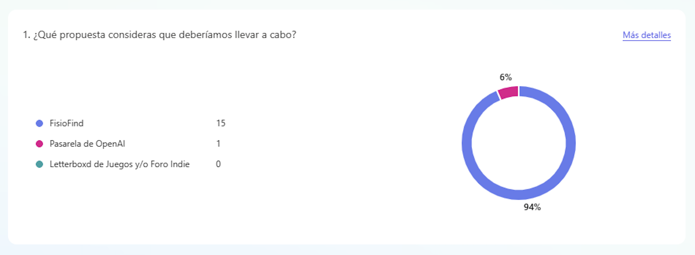

<!-- COMMENT THIS WHEN EXPORTING TO PDF -->

  

<h1 align="center" style="font-size: 30px; font-weight: bold;">
  FISIO FIND  -  REUNIÓN 11-02-2025
</h1>

 

**ÍNDICE**
- [**1. OBJETIVO DE LA REUNIÓN**](#1-objetivo-de-la-reunión)
- [**2. ORDEN DEL DÍA**](#2-orden-del-día)
- [**3. ACUERDOS Y DECISIONES**](#3-acuerdos-y-decisiones)
- [**4. CONCLUSIONES Y OBSERVACIONES**](#4-conclusiones-y-observaciones)
- [**5. ANEXO**](#5-anexo)
  - [5.1. LETTERBOX PARA VIDEOJUEGOS - RESUMEN](#51-letterbox-para-videojuegos---resumen)
  - [5.2. PASARELA OPENAI - RESUMEN](#52-pasarela-openai---resumen)
  - [5.3. FISIOFIND - RESUMEN](#53-fisiofind---resumen)
<!-- COMMENT WHEN EXPORTING TO PDF -->

 

---

**Ficha del documento**

- **Nombre del Proyecto:** FISIO FIND

- **Número de Grupo:** Grupo 6

- **Entregable:** #DP

- **Miembros del grupo:** Alberto Carmona Sicre, Antonio Macías Ferrera, Benjamín Ignacio Maureira Flores, Francisco Capote García, Daniel Alors Romero, Daniel Fernández Caballero, Daniel Ruiz López, Daniel Tortorici Bartús, Daniel Vela Camacho, Delfín Santana Rubio, Guadalupe Ridruejo Pineda, Julen Redondo Pacheco, Miguel Encina Martínez, Francisco Mateos Villarejo, Pablo Fernández Pérez, Ramón Gavira Sánchez, Rafael Pulido Cifuentes.

- **Contribuidores:** [Antonio Macías Ferrera](https://github.com/antoniommff) (autor)

- **Fecha de Creación:** 11/02/2025  

- **Versión:** v1.0

 

---

<!-- \newpage -->

**Histórico de Modificaciones**

| Fecha      | Versión | Realizada por                    | Descripción de los cambios |
|------------|---------|----------------------------------|----------------------------|
| 11/02/2025 | v1.0    | Antonio Macías Ferrera           | Elaboración del acta de la reunión. |

 

---

**Participantes**

| Nombre completo | Rol | Contacto |
|----------------|-----|----------|
| Antonio Macías Ferrera | -- | antmacfer1@alum.us.es |
| Benjamín Ignacio Maureira Flores | -- | benmauflo@alum.us.es |
| Daniel Alors Romero | -- | danalorom1@alum.us.es |
| Daniel Fernández Caballero | -- | danfercab@alum.us.es |
| Daniel Ruiz López | -- | danruilop1@alum.us.es |
| Daniel Tortorici Bartús | -- | dantorbar1@alum.us.es |
| Daniel Vela Camacho | -- | danvelcam@alum.us.es |
| Delfín Santana Rubio | -- | delsanrub@alum.us.es |
| Guadalupe Ridruejo Pineda | -- | guaridpin@alum.us.es |
| Miguel Encina Martínez | -- | migencmar@alum.us.es |
| Francisco Mateos Villarejo | -- | framatvil@alum.us.es |
| Pablo Fernández Pérez | -- | pablofp.33@gmail.com |
| Ramón Gavira Sánchez | -- | ramgavsan@alum.us.es |

 

<!-- \newpage -->

 

# **1. OBJETIVO DE LA REUNIÓN**

En esta reunión **se decidirá finalmente la nueva idea**, de acuerdo con lo que se concluyó en la última reunión del pasado domingo 09/02/2025 para elaborar una nueva idea que sustituya a la anterior de *GALLERY GUIDE*.

 

 

# **2. ORDEN DEL DÍA**

- ✅ **Tema 1:** Presentación de las nuevas propuestas de idea.

- ✅ **Tema 2:** Votación de la nueva idea con el formulario anónimo elaborado por Daniel Vela ([Form](https://forms.office.com/Pages/ResponsePage.aspx?id=DQSIkWdsW0yxEjajBLZtrQAAAAAAAAAAAAMAAM6F3TRUNzA1QTdIS0tWNEVaMEJGTjBBSjVSNEowSS4u)).

- ✅ **Tema 3:** Asignación de tareas.

 

 

# **3. ACUERDOS Y DECISIONES**

| Tema | Decisión |
|------|----------|
| Tema 1 | Daniel Vela como representante del grupo 3, Daniel Ruiz como representante del grupo 1, y Guadalupe Ridruejo como representante del grupo 2 expusieron las respectivas ideas de sus grupos en ese orden. Consultar **ANEXO** para ver un esbozo más detallado de cada propuesta. |
| Tema 2 | Se ha realizado la votación usando el formulario indicado anteriormente, resultando como ganadora la propuesta del Grupo 2: **FISIO FIND**.|
| Tema 3 | Se ha procedido a asignar las tareas en función de la idea elegida.|

 

 

# **4. CONCLUSIONES Y OBSERVACIONES**

- ✅ **Conclusión 1:** Ver **ANEXO**.

- ✅ **Conclusión 2:** La votación ha obtenido los siguientes resultados: 16 votos por *FISIO FIND* y un voto por *Pasarela de OpenAI*.

- ✅ **Conclusión 3:** Se han asignado las siguientes tareas:

  - **Elaboración de registro de requisitos, casos de uso y HU**: Grupo 1. También podría ser aconsejable hacer una matriz de trazabilidad o algún esquema más específico sobre la arquitectura del sistema, lo que se considere oportuno para repartir el trabajo equitativamente entre todos los miembros del grupo.

  - **Elaboración de presentación, diseño de marca y logo**: Grupo 2. Deben elaborar la presentación enfocándose en los aspectos clave (monetización, competidores, clientes/usuarios), establecer una estética de negocio (logo, colores, diseños) y preparar la exposición.

  - **Elaboración de reporte Agile Inception**: Grupo 3. Se debe hacer hincapié en los competidores especificando palabras clave y búsquedas, hacer un estudio de precios y establecer tres planes de precios claros para los fisioterapeutas, scope, diferentes clientes y/o usuarios y casos de uso.

**[NOTA]:** Todas estas tareas deben añadirse, estimarse y asignarse según corresponda por grupo en la plataforma Taiga.io.

<!-- \newpage -->

# **5. ANEXO**

## 5.1. LETTERBOX PARA VIDEOJUEGOS - RESUMEN  

***ELEVATOR SPEECH***

Plataforma similar a [Letterboxd](https://letterboxd.com) pero para videojuegos, donde los usuarios pueden calificar juegos con reseñas, estrellas y estados (pendiente, completado, abandonado).  
Incluye un foro para desarrolladores indies para promocionar proyectos, recaudar fondos y compartir demos. Integración con *Steam* y recomendaciones estilo *Tinder*, con moderación activa.  

***FEATURES PRINCIPALES***

- Valoración y reseñas de juegos. 

- Gestión de estados (pendiente, completado, abandonado).

- Sincronización con Steam.  

- Foro para desarrolladores con opción de *crowdfunding* y demos jugables.  

- Moderación de reseñas.  

- Sistema de recomendación estilo *Tinder*.  

***MONETIZACIÓN***

- **Plan Gratis:** Acceso básico al sistema de reseñas y recomendaciones limitadas.  

- **Plan Premium:** Acceso completo al sistema de recomendaciones.  

- Comisión del **5%** en *crowdfunding* de desarrolladores.  

- Espacio gratuito para demos con opción de ampliar almacenamiento mediante suscripción.  

***COMPETENCIA***

**Redes sociales para juegos**  
- **GG**, **Backloggd**, **Rawg.io**, **WeThePlayers**.  
- **GG** destaca por su desarrollo en app móvil.  

**Comunidades de gamers/desarrolladores**  
- **Foggers, Gameram, Roning, Raptr**.  
- Enfocadas en comunidad y matchmaking, no en desarrollo de juegos.  

**Tiendas de juegos y patrocinio**  
- **Steam, GOG, Green Man Gaming**.  
- Steam permite reseñas y comunidad, pero no funciona como un diario de videojuegos.  

**Otros competidores**  
- **Reddit, Itch.io, GameMaker, Chetu**.  
- Itch.io ofrece comunidad y subida de juegos pero no tiene una red social estructurada.  

 

## 5.2. PASARELA OPENAI - RESUMEN  

***ELEVATOR SPEECH***

Plataforma que ofrece acceso flexible a modelos de IA premium con precios ajustados al consumo real. Dirigida a usuarios que necesitan ChatGPT para tareas puntuales sin pagar una suscripción mensual completa.

***FEATURES PRINCIPALES***

- **Dashboard de consumo** con historial, tokens usados y feedback de respuestas.

- **Add-ons** para recargar tokens adicionales.

- **Selección de modelos** con aviso de consumo según la IA elegida.

⚠ **Debe ofrecer más que un simple chat para cumplir con OpenAI TOS.**  

***MONETIZACIÓN***

- **Gratis**: 50 peticiones al mes, dashboard básico.  

- **Plus (10€/mes)**: 6M de tokens, acceso a varios modelos, dashboard mejorado.

- **Pro (19€/mes)**: 12M de tokens, acceso total a modelos, dashboard avanzado.  

📌 *Precios sujetos a cambios tras estudio de mercado.*  

***COMPETENCIA***

**Competidores Directos**  

Plataformas que permiten usar modelos IA en local o en la nube, como: **Hugging Face, LM Studio, Ollama, GPT4All, PrivateGPT, Local.ai, Auto GPT, AgentGPT, Google AI Studio, etc.**  

**Competidores Indirectos**  

Cualquier chat de IA online.  

📌 Más información: [LM-Kit](http://lm-kit.net/LM-Kit)  

 

## 5.3. FISIOFIND - RESUMEN

***PUNTO DE PARTIDA***

- La **fisioterapia online** es tan efectiva como la presencial.

- Se enfoca en la **recuperación funcional** mediante el movimiento.

- Herramientas clave: **entrevista clínica y cuestionarios**.

- Mayor **accesibilidad** para personas con limitaciones de tiempo o movilidad.  

***ELEVATOR SPEECH***

**FISIO FIND** conecta fisioterapeutas y pacientes a través de **videoconsultas especializadas**.  
Ofrece herramientas interactivas como **mapas de dolor, modelos 3D y seguimiento de ejercicios**.  
Monetización basada en **suscripción mensual para fisioterapeutas** y pagos por consulta.  

***PROPUESTA DE VALOR***

FISIO FIND optimiza la **atención remota** mediante herramientas especializadas, facilitando consultas online de fisioterapia.  

***FEATURES PRINCIPALES***

**PARA FISIOTERAPEUTAS**  
- **Perfil profesional verificado**.  
- **Agenda y gestión de citas**.  
- **Videollamadas interactivas** con modelos 3D, mapas de dolor y herramientas de dibujo.  
- **Facturación automatizada** y gestión de pagos.  
- **Valoraciones y seguimiento** de pacientes.  

**PARA PACIENTES**  
- **Búsqueda y reserva** de fisioterapeutas por especialidad.  
- **Historial de consultas** y plan de tratamiento personalizado.  
- **Videoconsultas seguras** con cuestionario previo.  
- **Ejercicios prescritos** con seguimiento de dolor y progreso.  

***MONETIZACIÓN***

- **Suscripción mensual** para fisioterapeutas.  

- **Comisión opcional** por consulta.  

- **Planes premium** con mayor visibilidad.  

- **Publicidad dirigida** para clínicas y productos de fisioterapia.  

***DESARROLLO TECNOLÓGICO***

- **Plataforma web y app móvil (iOS/Android)**.

- **Pagos seguros** con Stripe/PayPal.

- **Videollamadas encriptadas** con herramientas avanzadas.

***ESTRATEGIA DE CAPTACIÓN***

- **Publicidad en redes** dirigida a fisioterapeutas autónomos.

- **Colaboraciones con asociaciones** de fisioterapia.

- **Prueba gratuita de 14 días**.

- **SEO y contenido educativo** para atraer pacientes.

***EXPANSIÓN Y FUTURO***

- **Asistente IA** para orientación previa.

- **Expansión a nutrición y rehabilitación deportiva**.  

***COMPETENCIA***

**COMPETIDORES DIRECTOS: Salucenter, FroomCare Pro, Physiotec, Mantra Care, Physio Tools**. Gestión de consultas y ejercicios, pero sin foco exclusivo en fisioterapia online.  

**COMPETIDORES INDIRECTOS**  

- **Plataformas de reserva de fisioterapeutas** como TUFISIO.

- **Apps de consulta general** como Doctoralia.

- **Portales de fisioterapeutas autónomos**.

📌 Más información en:  
- [React Body Highlighter](https://github.com/giavinh79/react-body-highlighter)  
- [Ejemplo en CodeSandbox](https://codesandbox.io/examples/package/reactjs-human-body)  

 

 

---

**Aprobado por:**  
**Scrum Master:** Antonio Macías Ferrera
