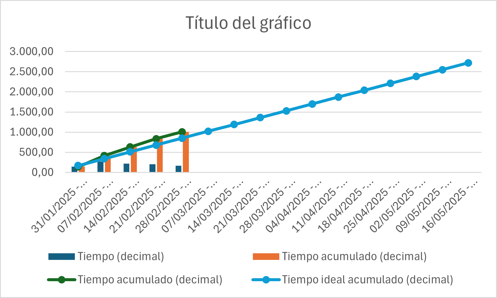

<!-- COMMENT THIS WHEN EXPORTING TO PDF -->

  

<h1 align="center" style="font-size: 30px; font-weight: bold;">
  FISIO FIND  -  MID TERM RETROSPECTIVE SPRINT 1
</h1>

 

**ÍNDICE**
1. [PROYECTOS](#1-proyectos)  
    1.1 [DEFINICIÓN DE CADA PROYECTO](#11-definición-de-cada-proyecto)  
    1.2 [PROYECTOS REALIZADOS EN LA SEMANA](#12-proyectos-realizados-en-la-semana)
    1.3 [PROYECTOS DESTACADOS](#13-proyectos-destacados)
2. [HORAS TOTALES](#2-horas-totales)
3. [DESGLOSE](#3-desglose)  
    3.1 [DESGLOSE POR DÍAS](#31-desglose-por-días)  
    3.2 [DESGLOSE POR PROYECTOS](#32-desglose-por-proyectos)  
    3.3 [DESGLOSE POR INTEGRANTES](#33-desglose-por-integrantes)
<!-- COMMENT WHEN EXPORTING TO PDF -->

 

---

**Ficha del documento**

- **Nombre del Proyecto:** FISIO FIND

- **Número de Grupo:** Grupo 6

- **Entregable:** #SPRINT 1

- **Miembros del grupo:** Alberto Carmona Sicre, Antonio Macías Ferrera, Benjamín Ignacio Maureira Flores, Francisco Capote García, Daniel Alors Romero, Daniel Fernández Caballero, Daniel Ruiz López, Daniel Tortorici Bartús, Daniel Vela Camacho, Delfín Santana Rubio, Guadalupe Ridruejo Pineda, Julen Redondo Pacheco, Miguel Encina Martínez, Francisco Mateos Villarejo, Pablo Fernández Pérez, Ramón Gavira Sánchez, Rafael Pulido Cifuentes.

- **Autores:** Benjamín Ignacio Maureira Flores, Daniel Alors Romero

- **Fecha de Creación:** 06/03/2025  

- **Versión:** v1.1

 

---

<!-- \newpage -->

**Histórico de Modificaciones**

| Fecha      | Versión | Realizada por                    | Descripción de los cambios |
|------------|---------|----------------------------------|----------------------------|
| 06/03/2025 | v1.0    | Benjamín Ignacio Maureira Flores, Daniel Alors Romero, Miguel Encina Martínez, Francisco Mateos Villarejo | Elaboración de la primera versión del documento |
| 09/03/2025 | v1.0    | Antonio Macías Ferrera | Correcciones ortográficas, elaboración en más detalle de algunos puntos (como los problemas encontrados), adición imagen *"reloj del proyecto"*. |

 

<!-- \newpage -->

 

# 1. INFORMACIÓN DEL ESTUDIO QA

La siguiente tabla muestra la evaluación detallada de cada miembro del equipo según los siguientes criterios:

- **Dedicación:** Porcentaje de tiempo dedicado al proyecto
- **Compensación:** Equilibrio en la distribución de tareas
- **Disponibilidad:** Porcentaje de tiempo disponible para el proyecto
- **Compromiso:** Nivel de implicación con el proyecto
- **Prácticas:** Cumplimiento de las buenas prácticas de desarrollo
- **Valoración Final:** Evaluación global (E: Excelente, B: Bueno, R: Regular)

| Alumno | Dedicación | Compensación | Disponibilidad | Compromiso | Prácticas | Valoración Final | 
| ------ | ---------- | ------------ | -------------- | ---------- | --------- | ---------------- |
| Alberto Carmona Sicre | 30% | X | 10% | 30% | 30% | E |
| Antonio Macías Ferrera | 30% | X | 10% | 30% | 30% | E |
| Benjamín Ignacio Maureira Flores | 30% | X | 10% | 30% | 30% | E |
| Francisco Capote García | 30% | X | 10% | 30% | 30% | E |
| Daniel Alors Romero | 30% | X | 8% | 30% | 30% | E |
| Daniel Fernández Caballero | 30% | X | 10% | 30% | 30% | E |
| Daniel Ruíz López | 30% | X | 10% | 30% | 30% | E |
| Daniel Tortorici Bartús | 30% | X | 10% | 28% | 30% | E |
| Daniel Vela Camacho | 30% | X | 10% | 30% | 30% | E |
| Delfín Santana Rubio | 30% | X | 10% | 30% | 30% | E |
| Guadalupe Ridruejo Pineda | 30% | X | 10% | 30% | 30% | E |
| Julen Redondo Pacheco | 30% | X | 10% | 30% | 30% | E |
| Miguel Encina Martínez | 30% | X | 10% | 30% | 30% | E |
| Francisco Mateos Villarejo | 30% | X | 10% | 30% | 30% | E |
| Pablo Fernández Pérez | 30% | X | 10% | 30% | 30% | E |
| Ramón Gavira Sánchez | 30% | X | 10% | 30% | 30% | E |
| Rafael Pulido Cifuentes | 30% | X | 10% | 28% | 30% | E |

 

# 2. PROBLEMAS ENCONTRADOS

Durante las dos primeras semanas de desarrollo, se han identificado varios desafíos significativos que han impactado en el avance del proyecto. A continuación, se detallan estos problemas, su resolución y su relación con los riesgos previamente identificados:

| Problema encontrado | Descripción detallada | Solución implementada | Riesgo relacionado | Estado | 
| ------------------- | -------------------- | -------------------- | ------------------ | ------ |
| Complejidad en tecnologías de frontend | La implementación de funcionalidades avanzadas como videollamadas y calendario interactivo requirió el uso de tecnologías y librerías desconocidas por el equipo | Se organizaron sesiones intensivas de formación y se dedicaron recursos adicionales al aprendizaje de estas tecnologías. Se creó documentación interna para futura referencia | RIG-004: Riesgo por desconocimiento tecnológico | Resuelto |
| Heterogeneidad en los sistemas de colegios profesionales | La verificación de colegiación requirió adaptarse a diferentes estructuras de datos y formatos de las páginas web de los colegios de fisioterapeutas por comunidad autónoma | Se desarrolló un sistema modular de scraping con modelos específicos para cada colegio, permitiendo una gestión flexible de los diferentes formatos de datos | RIG-006: Riesgo de integración con sistemas externos | Resuelto |
| Dependencias críticas entre tareas | La estructura secuencial de algunas tareas provocó que los retrasos en tareas críticas afectaran en cascada a otras dependientes | Se reorganizó la planificación para paralelizar tareas donde fue posible y se asignaron recursos adicionales a las tareas críticas para minimizar retrasos | N/A - Nuevo riesgo identificado | Resuelto |

# 3. RELOJ DEL AVANCE DEL PROYECTO 

El gráfico muestra el progreso actual del proyecto en relación con la planificación inicial. Destacamos:

- **Horas estimadas:** 170 horas semanales
- **Horas realizadas:** Superior a lo estimado
- **Causa principal:** Cambio significativo en el alcance durante la segunda semana que requirió concentrar el trabajo planificado para dos semanas en una sola
- **Impacto:** A pesar del esfuerzo adicional, se han alcanzado los objetivos planificados
- **Medidas futuras:** Se realizará un ajuste en la planificación para evitar situaciones similares en próximos sprints

---

**Aprobado por:**  
**Responsable de equipo de QA:** Miguel Encina Martínez
**Scrum Master:** Antonio Macías Ferrera  
**Fecha de aprobación:** 06/03/2025