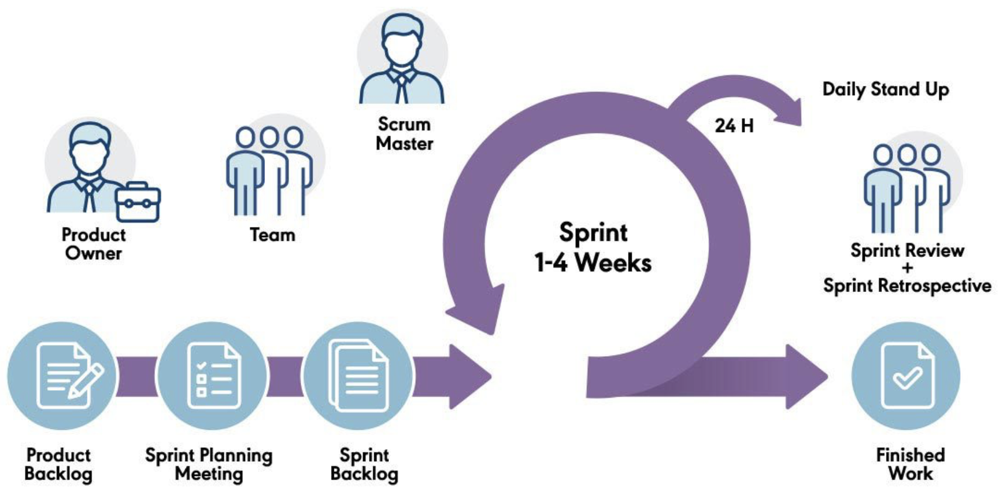
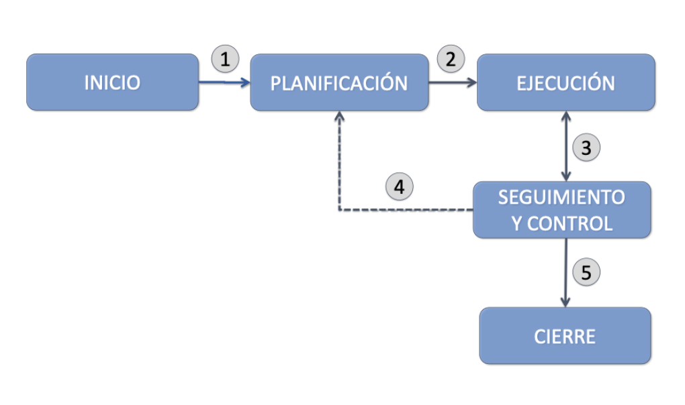
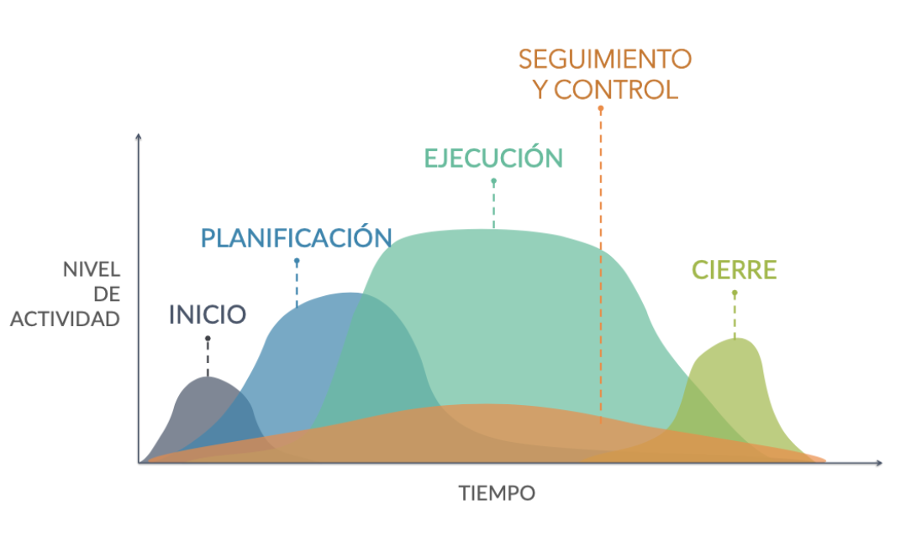
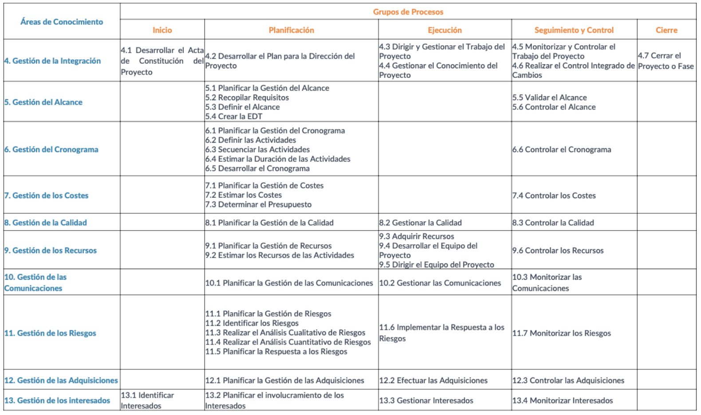
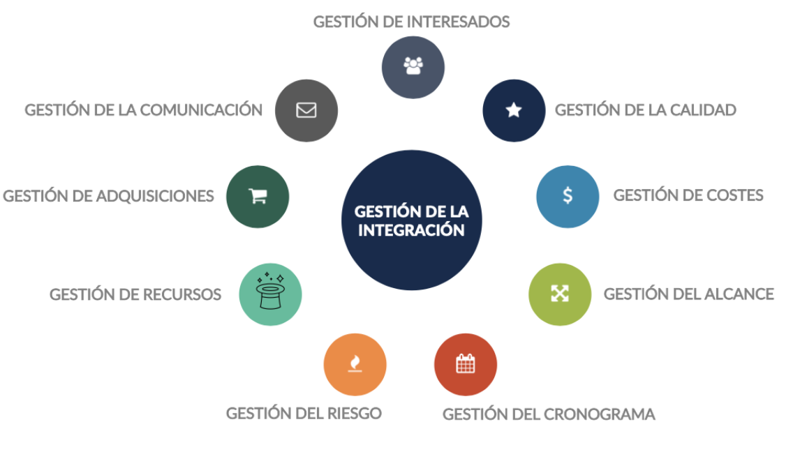
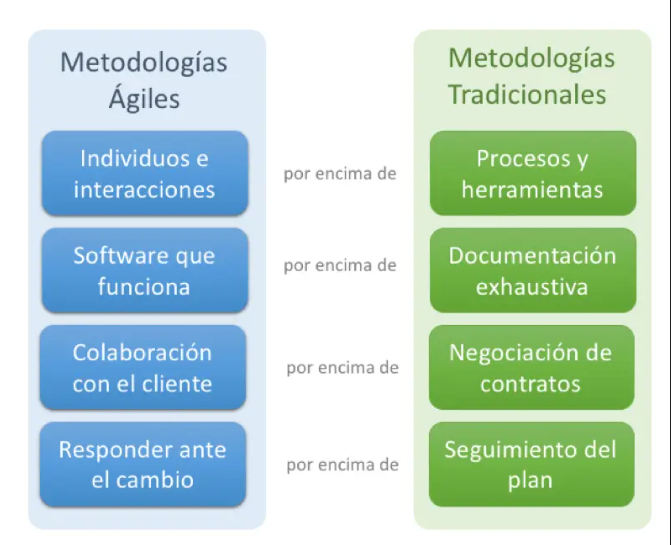
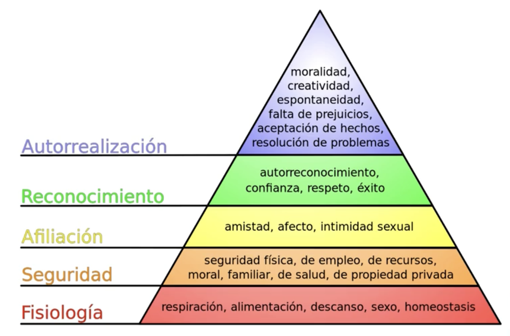
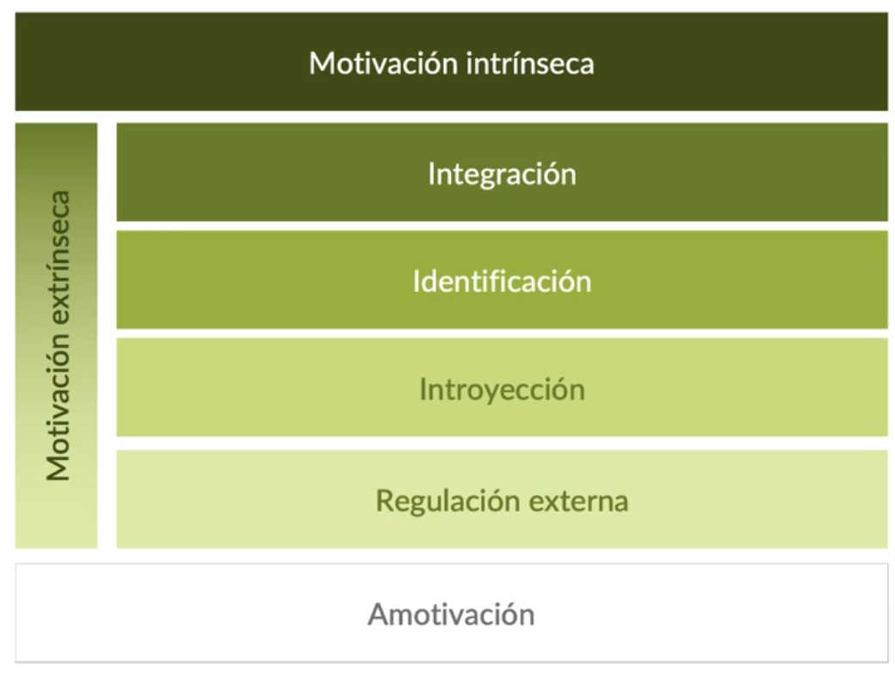

<!-- COMMENT THIS WHEN EXPORTING TO PDF -->

  

<h1 align="center" style="font-size: 30px; font-weight: bold;">
  ISPP - PÍLDORA TEÓRICA 1
</h1>

 

**ÍNDICE**
- [**1. METODOLOGÍAS ÁGILES: SCRUM**](#1-metodologías-ágiles-scrum)
- [**2. PMBOK**](#2-pmbok)
  - [**Tabla de procesos**](#tabla-de-procesos)
  - [**Áreas de conocimiento**](#áreas-de-conocimiento)
- [**3. FRACASOS DE LOS PROYECTOS SOFTWARE**](#3-fracasos-de-los-proyectos-software)
- [**4. GESTIÓN DE EQUIPOS**](#4-gestión-de-equipos)
  - [**6 formas de ser derrotado - El arte de la guerra (Sun Tzu)**](#6-formas-de-ser-derrotado---el-arte-de-la-guerra-sun-tzu)
  - [**Plan de RRHH**](#plan-de-rrhh)
  - [**Productividad de un equipo**](#productividad-de-un-equipo)
  - [**Pirámide de Maslow**](#pirámide-de-maslow)
  - [**Teoría de la autodeterminación**](#teoría-de-la-autodeterminación)
- [**5. GESTIÓN DE LAS COMUNICACIONES**](#5-gestión-de-las-comunicaciones)
- [**6. INFORMES DE DESEMPEÑO**](#6-informes-de-desempeño)
<!-- COMMENT WHEN EXPORTING TO PDF -->

 

---

**Ficha del documento**

- **Nombre del Proyecto:** FISIO FIND

- **Número de Grupo:** Grupo 6

- **Entregable:** #DP

- **Miembros del grupo:** Alberto Carmona Sicre, Antonio Macías Ferrera, Benjamín Ignacio Maureira Flores, Francisco Capote García, Daniel Alors Romero, Daniel Fernández Caballero, Daniel Ruiz López, Daniel Tortorici Bartús, Daniel Vela Camacho, Delfín Santana Rubio, Guadalupe Ridruejo Pineda, Julen Redondo Pacheco, Miguel Encina Martínez, Francisco Mateo Villalba, Pablo Fernández Pérez, Ramón Gavira Sánchez, Rafael Pulido Cifuentes.

- **Autores:** Antonio Macías Ferrera

- **Fecha de Creación:** 17/02/2024  

- **Versión:** v1.0

 

---

**Histórico de Modificaciones**

| Fecha      | Versión | Realizada por                    | Descripción de los cambios |
|------------|---------|----------------------------------|----------------------------|
| 17/02/2025 | v1.0    | Antonio Macías Ferrera           | Elaboración de la primera versión del documento. |

 

<!-- \newpage -->

 

# **1. METODOLOGÍAS ÁGILES: SCRUM**
Scrum es una metodología ágil enfocada en la entrega incremental de valor en proyectos de software. Se basa en roles clave como:

- **Product Owner**: Define los requisitos y gestiona el backlog.
- **Scrum Master**: Facilita el proceso y elimina impedimentos.
- **Development Team**: Desarrolla el producto en iteraciones llamadas *sprints*.

Cada sprint tiene eventos como:

- **Sprint Planning**: Definición del trabajo del sprint.
- **Daily Scrum**: Reunión diaria para sincronizar el equipo.
- **Sprint Review**: Presentación del trabajo completado.
- **Sprint Retrospective**: Reflexión y mejora continua.

 

<!-- \newpage -->

 

# **2. PMBOK**
El PMBOK es un estándar para la gestión de proyectos que incluye:

## **Tabla de procesos**

## **Áreas de conocimiento**

1. **Integración**: Procesos necesarios para coordinar las diferentes áreas, identificando, definiendo y coordinando los procesos y actividades de la dirección de proyectos.

2. **Alcance**: Procesos para la identificación y control del trabajo requerido en el proyecto.

3. **Cronograma**: Procesos para la identificación de hitos y creación y seguimiento del calendario de ejecución del proyecto.

4. **Costes**: Procesos para la preparación y control del presupuesto.

5. **Calidad**: Procesos que determinan y controlan los procedimientos y las actividades para que el proyecto satisfaga las necesidades que motivaron su creación.

6. **Recursos**: Procesos que organizan, dirigen y controlan a los equipos de trabajo. Procesos que definen los recursos necesarios para la ejecución del proyecto.

7. **Comunicaciones**: Procesos para la recopilación y distribución de la información.

8. **Riesgos**: Procesos de identificación y seguimiento de riesgos.

9. **Adquisiciones**: Procesos para comprar, adquirir y controlar los productos y servicios para realizar el trabajo.

10. **Interesados**: Procesos para la identificación y gestión de los interesados.

 

 

# **3. FRACASOS DE LOS PROYECTOS SOFTWARE**

*Software Project Management For Dummies* establece **9 razones** principales por las que puede fallar un proyecto:

- 📅 **Falta de plan**

- 📊 No hacer caso a la gestión de riesgos

- 📑 No tener control de costes, calidad, tiempo

- 🙈 Esconderse del equipo

- 🥵 Asfixiar al equipo

- 🏃 Horarios y deadlines surrealistas

- 🤪 Ser incoherente

- 🙄 El *ego*

- 🫥 No hacer nada

 

<!-- \newpage -->

 

# **4. GESTIÓN DE EQUIPOS**

- Sin equipo no hay proyecto. 
- Fomentar la comunicación y la comunidad → base de conocimiento.

## **6 formas de ser derrotado - El arte de la guerra (Sun Tzu)**

1. **No calibrar el número de fuerzas**

2. **Ausencia de un sistema claro de recompensas y castigos**

3. **Falta de entrenamiento**

4. **Pasión irracional**

5. **Ineficacia de la ley del orden**

6. **No seleccionar soldados fuertes y resueltos**

## **Plan de RRHH**

- **Roles**: enunciado de roles, definición de responsabilidades y habilidades (rol, responsabilidad, autoridad y habilidades)

- **Organigrama**: asignación de responsabilidades, asignación de tareas y responsabilidades, matriz RACI.

- **Gestión del personal**: entrenamiento, revisión del rendimiento, reconocimientos y recompensas.

## **Productividad de un equipo**

**PRODUCTIVIDAD** GRUPAL = ∑ PRODUCTIVIDAD INDIVIDUAL - RUIDO

**RUIDO** = MAIL, MÓVIL, REUNIONES SIN ORDEN, REUNIONES INNECESARIAS, INTERRUP-
CIONES EXTERNAS

## **Pirámide de Maslow**

## **Teoría de la autodeterminación**

 

<!-- \newpage -->

 

# **5. GESTIÓN DE LAS COMUNICACIONES**
La comunicación en proyectos de software debe ser clara y efectiva. Se recomienda:

- Usar herramientas de comunicación interna.

- Definir flujos de comunicación.

- Asegurar transparencia en la toma de decisiones.

Para elaborar un buen *Plan de Gestión de la Comunicación* nos debemos preguntar:

- ¿QUÉ INFORMACIÓN NECESITAN LOS INTERESADOS?

- ¿QUIÉN RECIBIRÁ Y QUIÉN DISTRIBUIRÁ LA INFORMACIÓN?

- ¿CUÁNDO NECESITARÁN LA INFORMACIÓN?

- ¿CÓMO SE DISTRIBUIRÁ LA INFORMACIÓN?

- ¿CUÁNTOS CANALES EXISTEN?

- ¿QUÉ TECNOLOGÍA SE UTILIZARÁ?

- ¿QUIÉN SE COMUNICA CON QUIÉN?

- ¿CON QUÉ FRECUENCIA SE REALIZA LA COMUNICACIÓN?

 

 

# **6. INFORMES DE DESEMPEÑO**

- Recopila la información sobre el desempeño del proyecto (informes de estado, mediciones del avance, predicciones, etc.) y la distribuye.

- Presenta las solicitudes de cambio.

- Trackear el tiempo empleado en las tareas.

