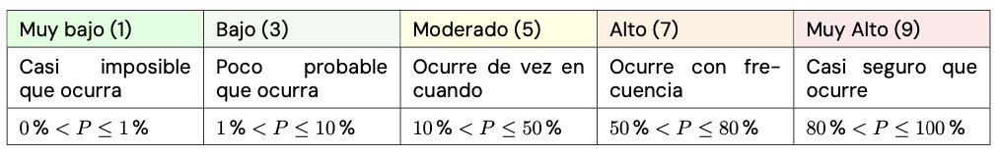
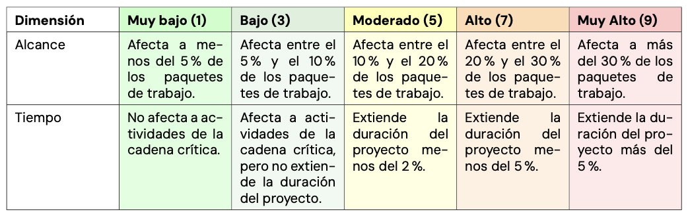
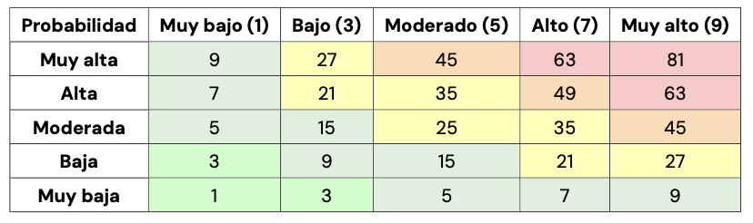
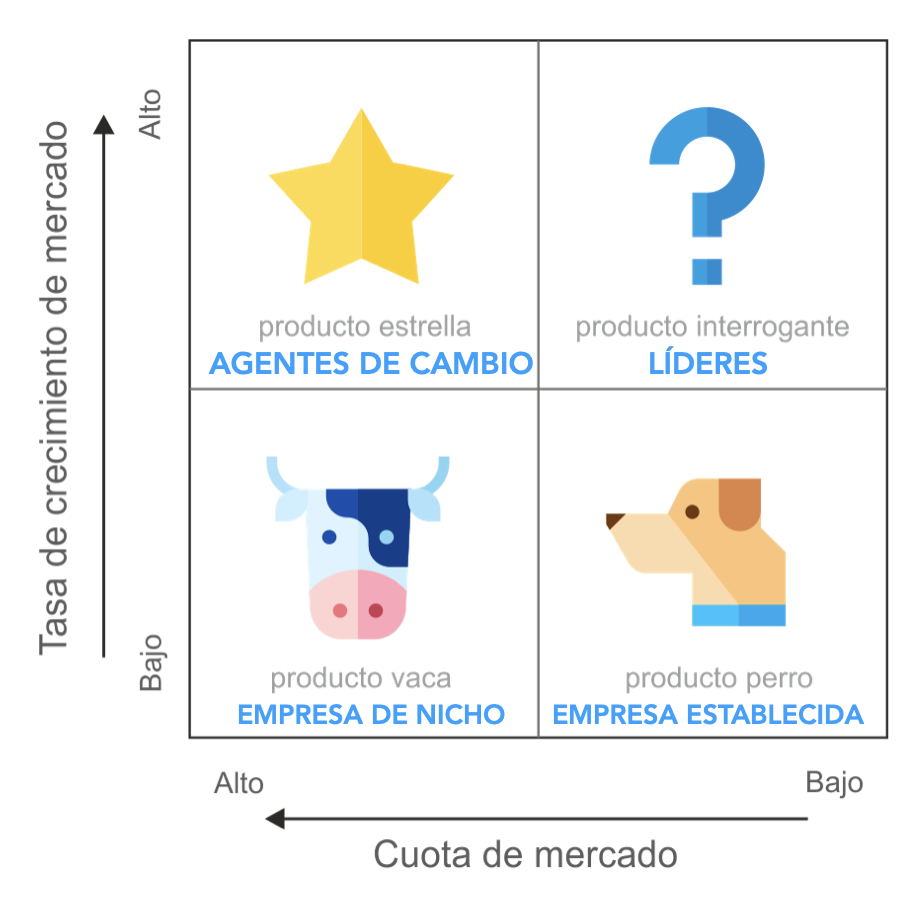
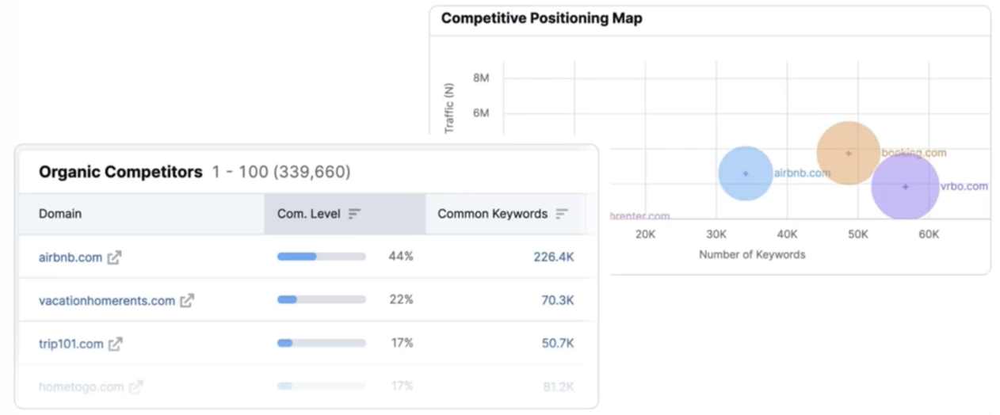

<!-- COMMENT THIS WHEN EXPORTING TO PDF -->

  

<h1 align="center" style="font-size: 30px; font-weight: bold;">
  ISPP - PÍLDORA TEÓRICA 2
</h1>

 

**ÍNDICE**
- [**1. GESTIÓN DE RIESGOS**](#1-gestión-de-riesgos)
  - [**Identificación / Clasificación**](#identificación--clasificación)
  - [**Análisis / priorización**](#análisis--priorización)
  - [**Mitigación**](#mitigación)
  - [**Monitoreo**](#monitoreo)
- [**2. GESTIÓN DE USUARIOS PILOTO**](#2-gestión-de-usuarios-piloto)
  - [**Pilot testing vs Beta testing**](#pilot-testing-vs-beta-testing)
- [**3. ANÁLISIS DE COMPETIDORES**](#3-análisis-de-competidores)
  - [**Tipos de competencia**](#tipos-de-competencia)
  - [**Identificación de competidores**](#identificación-de-competidores)
  - [**Búsqueda de competidores (4Ps)**](#búsqueda-de-competidores-4ps)
- [**5. GESTIÓN DE LAS COMUNICACIONES**](#5-gestión-de-las-comunicaciones)
- [**6. INFORMES DE DESEMPEÑO**](#6-informes-de-desempeño)
<!-- COMMENT WHEN EXPORTING TO PDF -->

 

<!-- \newpage -->

 

# **1. GESTIÓN DE RIESGOS**
La gestión de los riesgos siempre pasa por estas 4 fases: **IDENTIFICACIÓN / CLASIFICACIÓN, ANÁLISIS / PRIORIZACIÓN, MITICACIÓN, MONITOREO**. 

## **Identificación / Clasificación**

**Contenido del registro de incidencias**

- Tipo de incidente 

- Descripción 

- Prioridad 

- Fecha de incidente 

- Estado 

- Solución 

- Fecha de solución

**Factores que influyen en los riesgos** 
- Grado de innovación tecnológica 

- Baja productividad 

- Cambio de requisitos 

- Documentación deficiente 

- Arquitectura del sistema no planificada 

- Falta de compromiso 

- Falta de pruebas del sistema. 

- Falta de comunicación 

- Factor de bus 

- Mala calidad del código 

- Cuestiones presupuestarias 

- Plazos agresivos

**Clasificación de riesgos (Ejemplo)** 

- RIESGOS EN EL ALCANCE (RAL-000) 

- RIESGOS EN EL CRONOGRAMA (RCR-000) 

- RIESGOS EN LOS COSTES (RCO-000) 

- RIESGOS DE CALIDAD (RCA-000) 

- RIESGOS DE RECURSOS HUMANOS (RRH-000) 

- RIESGOS DE COMUNICACIONES (RCM-000) 

- RIESGOS EN LAS ADQUISICIONES (RAD-000) 

- RIESGOS DE STAKEHOLDERS (RST-000)

## **Análisis / priorización**

**Definiciones de probabilidad**

**Definiciones de impacto**

**Matriz probabilidad x impacto**

## **Mitigación**

laboración de planes de contingencia: **EVITAR - MITIGAR - ACEPTAR**.

## **Monitoreo**

Ejecución del plan de contingencia → empleo de acciones correctivas → **monitoreo de las acciones correctivas**. 

Se debe controlar que las acciones de mitigación de riesgos se están cumpliendo realmente, y  reelaborar el plan de contingencia y/o aplicar nuevas acciones correctivas si fuera necesario

 

<!-- \newpage -->

 

# **2. GESTIÓN DE USUARIOS PILOTO**

Un desempeño correcto de la gestión de los usuarios piloto debería contener: 

1. **Selección *adecuada* de los usuarios piloto** 

2. Selección adecuada de **escenarios de prueba** 

3. **Planificación** de pruebas 

4. Buena **comunicación**

5. **Encuestas e *informes*** completos 

6. Registro de ***feedback*** / **conclusiones** 

**Sobre las encuestas**: 

- **Preguntas *adecuadas*** (evita la complejidad) 

- Establecer **medidas de éxito**: puntuación de 1 a 5, ⭐ ⭐ ⭐, 😁 😐 😡.

- Elaborar tendencias y **estadísticas** de puntuación de los usuarios piloto 

- Definir objetivos **medibles** 

- ***¡Hay que fomentar el pilotaje!*** El usuario debe sentirse escuchado, atendido y con ganas de seguir participando. Puede ser buena idea usar incentivos dentro de la aplicación. 

## **Pilot testing vs Beta testing**

|               | Pruebas piloto | Pruebas beta |
| ------------- |----------------|--------------|
| **Hecho por** | Grupo seleccionado de usuarios (Público objetivo) | Usuarios finales |
| **Requiere**  | Solo el entorno de desarrollo | El entorno real |
| **Hecho**     | Antes del despliegue en producción | Después de la implementación en producción |
| **Realizado** | En el componente del sistema o en el sistema completo | En el sistema completo |
| **Para**      | Verificar la preparación del producto para el despliegue | Para minimizar el riesgo de fallo del producto completo y "final" |

 

<!-- \newpage -->

 

# **3. ANÁLISIS DE COMPETIDORES**

Un **análisis de competidores** es el proceso de identificación de competidores en un mercado y evaluarlos frente a un conjunto de negocios predeterminados. 

El **objetivo** es superar a los competidores que tienen objetivos similares a los nuestros, y ofrecer un servicio diferencial

## **Tipos de competencia**

- 🥊 ***Competencia a nivel empresarial***: Productos o servicios similares, Tamaño y comunidad similares. 

- 🤩 ***Competencia aspiracional***: Marca muy superior. Comunidad muy superior. 

- 🔑 ***Competencia de palabras clave***: Palabras clave relacionadas con el mismo modelo de negocio. 

## **Identificación de competidores**

Identificar **audiencia objetiva** → buscar palabras clave y búsqueda en redes sociales. 

Herramientas para la búsqueda de competidores: [Semrush](https://es.semrush.com/). 

**Cuadrante de crecimiento**

Muestra el ritmo al que competidores similares crecen en el mercado.

**Mapa de posicionamiento** 

Relación entre numero de palabras clave comunes vs tráfico.

## **Búsqueda de competidores (4Ps)** 

� Producto

- ¿Cuál es su ***producto*** o servicio más popular? 

- ¿Qué ***características*** ofrece el producto? 

- ¿Quién es el ***público objetivo*** de este producto?
 
- ¿Qué ***problema*** resuelve este producto? 

� Lugar 

- ¿***Dónde compra su público*** objetivo? 

- ¿Qué ***canales de distribución*** deberías usar para llegar a tu audiencia? 

� Precios 
- ¿***Cómo se alinean los precios*** de los productos de su competidor ***con productos comparables***? 

- ¿Tienen ***rebajas*** frecuentes, descuentos u otras ofertas especiales? 

� Promoción 
- ¿Cuál de los canales promocionales de su competidor funciona mejor? 

- ¿El mensaje de su marca resuena con su público objetivo? 

Herramientas: Metricool, SimilarWeb, [ahrefs](https://ahrefs.com/es/site-explorer).

 

<!-- \newpage -->

 

# **5. GESTIÓN DE LAS COMUNICACIONES**
La comunicación en proyectos de software debe ser clara y efectiva. Se recomienda:

- Usar herramientas de comunicación interna.

- Definir flujos de comunicación.

- Asegurar transparencia en la toma de decisiones.

Para elaborar un buen *Plan de Gestión de la Comunicación* nos debemos preguntar:

- ¿QUÉ INFORMACIÓN NECESITAN LOS INTERESADOS?

- ¿QUIÉN RECIBIRÁ Y QUIÉN DISTRIBUIRÁ LA INFORMACIÓN?

- ¿CUÁNDO NECESITARÁN LA INFORMACIÓN?

- ¿CÓMO SE DISTRIBUIRÁ LA INFORMACIÓN?

- ¿CUÁNTOS CANALES EXISTEN?

- ¿QUÉ TECNOLOGÍA SE UTILIZARÁ?

- ¿QUIÉN SE COMUNICA CON QUIÉN?

- ¿CON QUÉ FRECUENCIA SE REALIZA COMUNICACIÓN?

 

 

# **6. INFORMES DE DESEMPEÑO**

- Recopila la información sobre el desempeño del proyecto (informes de estado, mediciones del avance, predicciones, etc.) y la distribuye.

- Presenta las solicitudes de cambio.

- Trackear el tiempo empleado en las tareas.

