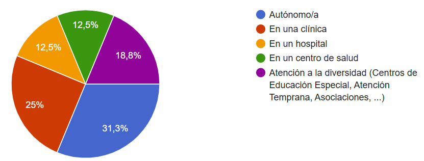
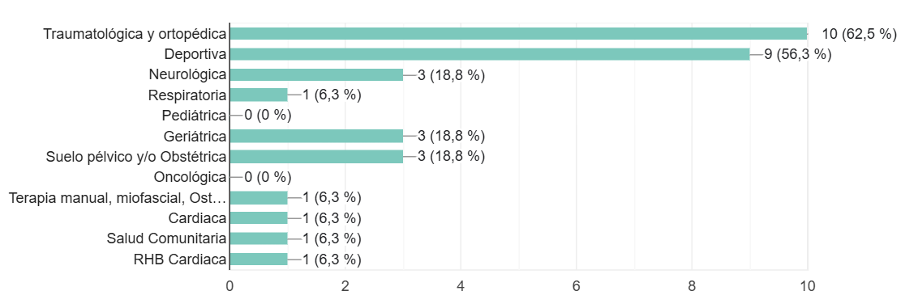
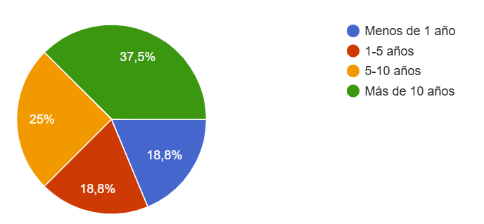
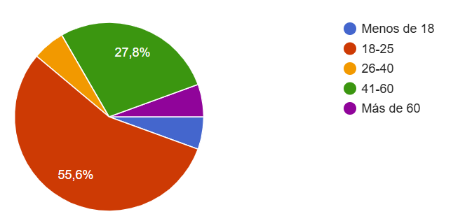
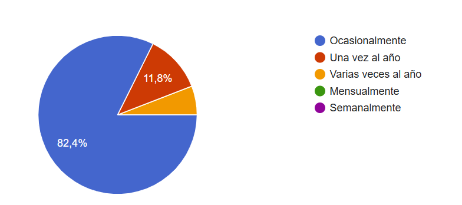
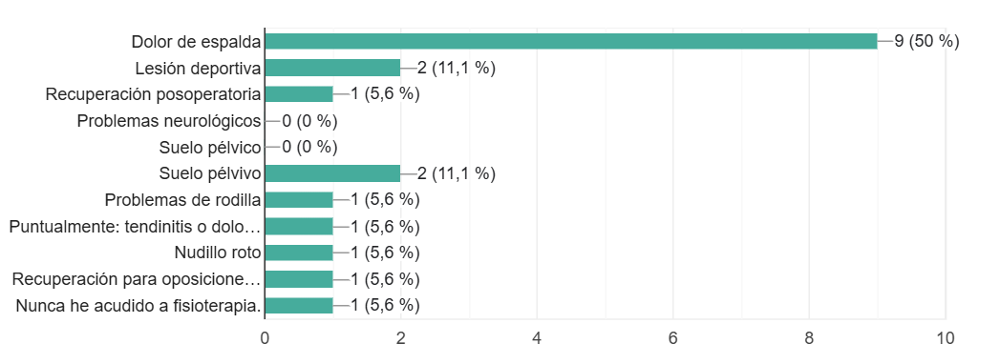
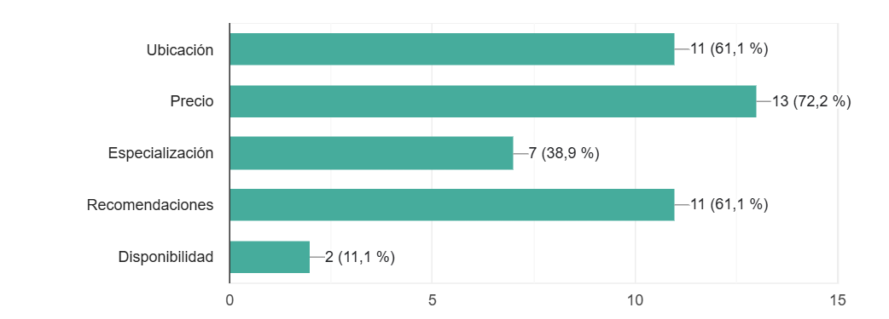

<!-- COMMENT THIS WHEN EXPORTING TO PDF -->

  

<h1 align="center" style="font-size: 30px; font-weight: bold;">
  FISIO FIND  -  ACUERDO CON USUARIOS PILOTO
</h1>

 

**ÍNDICE**
- [1. INTRODUCCIÓN](#1-introducción)
- [2. OBTENCIÓN DE USUARIOS PILOTO](#2-obtención-de-usuarios-piloto)
  - [2.1. CRITERIOS DE SELECCIÓN](#21-criterios-de-selección)
  - [2.2. ESTRATEGIAS DE CAPTACIÓN Y CANALES UTILIZADOS](#22-estrategias-de-captación-y-canales-utilizados)
- [3. DETALLES DEL ACUERDO CON LOS USUARIOS PILOTO](#3-detalles-del-acuerdo-con-los-usuarios-piloto)
  - [3.1. ALCANCE DEL ACUERDO](#31-alcance-del-acuerdo)
  - [3.2. DERECHOS Y RESPONSABILIDADES DE LOS USUARIOS PILOTO](#32-derechos-y-responsabilidades-de-los-usuarios-piloto)
    - [Derechos](#derechos)
    - [Responsabilidades](#responsabilidades)
  - [3.3. DURACIÓN Y CONDICIONES DE PARTICIPACIÓN](#33-duración-y-condiciones-de-participación)
    - [Fechas de prueba](#fechas-de-prueba)
    - [Estructura de las pruebas](#estructura-de-las-pruebas)
- [4. LISTA DE USUARIOS PILOTO](#4-lista-de-usuarios-piloto)
    - [FISIOTERAPEUTAS](#fisioterapeutas)
    - [PACIENTES](#pacientes)
    - [USUARIOS PILOTO TÉCNICOS](#usuarios-piloto-técnicos)
- [5. GESTIÓN DE LAS COMUNICACIONES CON LOS USUARIOS PILOTO](#5-gestión-de-las-comunicaciones-con-los-usuarios-piloto)
  - [5.1. CANALES DE COMUNICACIÓN](#51-canales-de-comunicación)
  - [5.2. FRECUENCIA DE INTERACCIONES](#52-frecuencia-de-interacciones)
  - [5.3. DOCUMENTACIÓN Y SOPORTE](#53-documentación-y-soporte)
- [6. FEEDBACK OBTENIDO](#6-feedback-obtenido)
- [7. CONCLUSIONES, LECCIONES APRENDIDAS Y PROCESADO DEL FEEDBACK](#7-conclusiones-lecciones-aprendidas-y-procesado-del-feedback)
- [8. EVALUACIÓN DE LA EXPERIENCIA PILOTO](#8-evaluación-de-la-experiencia-piloto)
<!-- COMMENT THIS WHEN EXPORTING TO PDF -->

 

---

**Ficha del documento**

- **Nombre del Proyecto:** FISIO FIND

- **Número de Grupo:** Grupo 6

- **Entregable:** #SPRINT 1

- **Miembros del grupo:** Alberto Carmona Sicre, Antonio Macías Ferrera, Benjamín Ignacio Maureira Flores, Francisco Capote García, Daniel Alors Romero, Daniel Fernández Caballero, Daniel Ruiz López, Daniel Tortorici Bartús, Daniel Vela Camacho, Delfín Santana Rubio, Guadalupe Ridruejo Pineda, Julen Redondo Pacheco, Miguel Encina Martínez, Francisco Mateos Villarejo, Pablo Fernández Pérez, Ramón Gavira Sánchez, Rafael Pulido Cifuentes.

- **Contribuidores:** [Delfín Santana](https://github.com/DelfinSR) (autor), [Antonio Macías](https://github.com/antoniommff) (autor), [Guadalupe Ridruejo](https://github.com/guaridpin) (revisor)

- **Fecha de Creación:** 10/02/2025  

- **Versión:** v1.5

 

---

**Historial de modificaciones**

| Fecha      | Versión | Realizada por             | Descripción de los cambios                                                      |
| ---------- | ------- | ------------------------- | ------------------------------------------------------------------------------- |
| 10/02/2025 | v1.0    | Delfín Santana Rubio      | Versión inicial del documento    |
| 15/02/2025 | v1.1    | Antonio Macías Ferrera    | Adaptación a usuarios piloto externos y alumnos de la asignatura ISPP           |
| 18/02/2025 | v1.2    | Delfín Santana Rubio      | Cambio en los beneficios para los usuarios  (se puede ver en el apartado 2.1.2) |
| 20/02/2025 | v1.3    | Guadalupe Ridruejo Pineda | Firmas de los primeros usuarios piloto     |
| 26/02/2025 | v1.4    | Guadalupe Ridruejo Pineda | Últimas firmas de usuarios piloto    |
| 10/03/2025 | v1.5    | Antonio Macías Ferrera | Correcciones finales para la entrega del #SPRINT 1  |

 

<!-- \newpage -->

 

# 1. INTRODUCCIÓN

En este documento se detallan el proceso de comunicación con los usuarios piloto, sus perfiles personales y profesionales, enunciado de su acuerdo de compromiso, y la forma de gestión del feedback y de la evaluación de los usuarios piloto alumnos de la asignatura ISPP.

 

# 2. OBTENCIÓN DE USUARIOS PILOTO

Para garantizar la validez de las pruebas piloto, fue fundamental establecer criterios claros para la selección de usuarios, definir estrategias efectivas de captación y utilizar los canales de comunicación más adecuados. A continuación, se detallan estos aspectos clave en el proceso de reclutamiento.

## 2.1. CRITERIOS DE SELECCIÓN

Tal y como se detalló en el documento [Acuerdo de usuarios piloto](../../01_organization/pilot_user_agreement.md), se disinguen dos categorías principales de usuarios piloto:

- **Usuario piloto externo**:  persona ajena al entorno académico del proyecto, cuya función es dar impresiones y sugerencias sobre la usabilidad y funcionalidad de la aplicación sin entrar en detalles técnicos. Dentro de esta categoría se distinguen dos roles principales:
  - **Fisioterapeutas**: Son los usuarios clave en el proceso de validación, ya que la plataforma debe adaptarse a sus necesidades y flujos de trabajo. Su retroalimentación será fundamental para definir y ajustar las herramientas especializadas, la gestión de consultas y la experiencia de uso profesional.
  - **Pacientes**: Su participación se centrará en evaluar la usabilidad y la experiencia de usuario de la plataforma. Sus opiniones ayudarán a mejorar la navegación, la accesibilidad y la claridad en la interacción con los fisioterapeutas, asegurando que el servicio sea intuitivo y fácil de usar.

- **Usuario piloto técnico**: estudiante de la asignatura ISPP que proporciona *feedback* detallado, reporta incidencias y ayuda a detectar errores en la aplicación, centrándose en su funcionamiento más que en la experiencia de usuario.

El tipo de usuario piloto que más difícil ha sido de encontrar, y de conseguir su compromiso para todo el periodo de pruebas, han sido los fisioterapeutas. Desconocemos el alcance real que alcanzó el formulario de inscripción para este tipo de usuarios, pero podemos estimar que 1 de cada 4 fisioterapeutas que tuvieron acceso al mismo se inscribieron. Finalmente, obtuvimos una lista definitiva de **16 usuarios piloto fisioterapeutas**, con los siguientes perfiles profesionales:

- **Lugar / forma de trabajo**:
  
- **Especialidades**:
  
- **Años de experiencia**:
  

En el caso de los usuarios piloto que actuarán en el rol de paciente, el proceso de captación fue mucho más sencillo. La gran mayoría de las personas inscritas son familiares cercanos, vecinos o amigos de miembros del equipo de FISIO FIND. Se ha procurado cubrir todas las franjas de edad posibles, para obtener un *feedback* que nos permita adaptar la plataforma al nivel de conocimientos y habilidades tecnológicas de cualquier persona. Todas las personas a las que se solicitó inscribirse así lo hicieron, dejando una lista definitiva con **18 usuarios piloto pacientes**, con las siguientes características destacables:

- **Edad**:
  
- **Frecuencia de consulta con un fisioterapeuta**:
  
- **Motivos más frecuentes de consulta**:
  
- **Qué aspectos priorizan a la hora de escoger fisioterapeuta**:
  

Por último, indicar que para los usuarios piloto técnicos tenemos a **6 alumnos de la asignatura ISPP** inscritos para las pruebas.

## 2.2. ESTRATEGIAS DE CAPTACIÓN Y CANALES UTILIZADOS
 
La estrategia empleada para captar usuarios piloto ha sido el **envío de un formulario de inscripción**, diferente para fisioterapeutas y pacientes, mediante **WhatsApp**. 

Estos dos formularios se hicieron empleando la herramienta ***Google Forms***. En ambos casos, el formulario indicaba de forma explícita qué implica ser usuario piloto de una plataforma, en qué fechas deben estar disponibles (con cierta flexibilidad), a qué se comprometen aceptando los términos de participación y nuestro compromiso como equipo a no compartir los datos recogidos durante el periodo de pruebas con terceros. En el caso de los fisioterapeutas, se les explicó que su participación sería recompensada con una suscripción gratuita permanente a la plataforma, como agradecimiento por su colaboración. 

En el caso de los **fisioterapeutas**, se envió un **primer correo** con un formulario adjunto de inscripción desde la dirección de *email corporativa* **info@fisiodind.com** a las 12 personas que mostraron un interés inicial en participar como usuarios piloto de la plataforma en el primer sonseo de viabilidad del proyecto. Este formulario, a parte de lo expuesto en el párrafo anterior, pretendía recoger también información sobre sus perfiles profesionales.
De los 12 fisioterapeutas que recibieron el correo, solo 5 se inscribieron a través del formulario adjunto. Ante la falta de usuarios piloto, pedimos a nuestros conocidos fisioterapeutas que **compartieran el formulario por WhatsApp con sus compañeros de profesión**. El formulario llegó hasta el "Grupo de Fisioterapeutas de Extremadura", desde donde hemos recibido más participación y nos ha permitido alcanzar la cifra de 16 usuarios piloto fisioterapeutas.

Para la captación de pacientes, se siguió una estrategia similar. Todos nuestros **conocidos** que, de manera informal habían mostrado interés en participar en las pruebas, recibieron un **mensaje de WhatsApp con el formulario** de inscripción. Además de los términos de participación ya expuestos, se hicieron algunas preguntas para elaborar un perfil demográfico de los pacientes inscritos y sobre su relación y experiencia con la fisioterapia como pacientes.

Todos los usuarios piloto inscritos, incluidos los técnicos, recibieron un **correo de confirmación de participación** desde nuestra cuenta de email oficial info@fisiofind.com.

 

# 3. DETALLES DEL ACUERDO CON LOS USUARIOS PILOTO

Para establecer una relación clara y beneficiosa con los usuarios piloto, se definieron los términos del acuerdo, incluyendo el alcance de la colaboración, derechos y responsabilidades, así como la duración y condiciones de participación.  

## 3.1. ALCANCE DEL ACUERDO  

El [Acuerdo de usuarios piloto](../01_organization/pilot_user_agreement.md) estableció los límites de su participación en el proyecto, asegurando una colaboración estructurada que permitiera obtener *feedback* constuctivo y completo sin generar compromisos excesivos para los participantes.  

En este sentido, los usuarios piloto se comprometieron a probar la plataforma en distintas fases de su desarrollo y proporcionar retroalimentación detallada para mejorar su funcionamiento y usabilidad. La participación en las pruebas es de carácter voluntario y no vinculante, pero esencial para la evolución del producto.  

El alcance de su colaboración se limitará a la evaluación de funcionalidades, experiencia de usuario y detección de posibles errores, (o incoherencias y sugerencias de mejora en el caso de los fisioterapeutas), sin requerir conocimientos técnicos avanzados.  

## 3.2. DERECHOS Y RESPONSABILIDADES DE LOS USUARIOS PILOTO

Los usuarios piloto contaban con derechos y responsabilidades específicos que garantizaban una participación efectiva en el proceso de validación de Fisio Find:  

### Derechos 
- Acceder a la plataforma en fase de pruebas antes de su lanzamiento.  
- Proporcionar sugerencias y reportar incidencias en la usabilidad y funcionalidad.  
- Obtener una suscripción gratuita de por vida como reconocimiento a su apoyo (solo fisioterapeutas). 
- Ser informados sobre cualquier cambio relevante en el proceso de prueba.  
- Retirarse del programa de usuarios piloto en cualquier momento, si así lo desean.

### Responsabilidades 
- Probar la aplicación siguiendo las instrucciones proporcionadas.  
- Ofrecer feedback sincero y detallado en los formularios de evaluación.  
- No compartir información confidencial sobre la plataforma con terceros.  
- Entender que están interactuando con una versión en desarrollo, por lo que podrían encontrarse errores o limitaciones.  

## 3.3. DURACIÓN Y CONDICIONES DE PARTICIPACIÓN

El programa de usuarios piloto se ha estructurado en tres fases de prueba, con fechas establecidas y condiciones específicas para asegurar una evaluación progresiva de la plataforma.  

### Fechas de prueba 
Los usuarios piloto podrán acceder a la plataforma y brindar su *feedback* en diferentes iteraciones:  

- **22 de marzo de 2025**  
- **12 de abril de 2025**  
- **3 de mayo de 2025**  

>[!NOTE]
Las fechas son estimadas y flexibles, por lo que no era imprescindible estar disponible exactamente en esos días.

### Estructura de las pruebas
Cada sesión de prueba inclurá los siguientes pasos:  

- Acceso a la plataforma a través de un enlace con instrucciones detalladas.  
- Realización de una serie de interacciones dentro de la app.  
- Completar un breve formulario sobre la experiencia de uso, sugerencias de mejora y errores observados.

Se estima que el tiempo de cada prueba estará en torno a los 15-20 minutos. 

A todos los usuarios piloto se les enviará mediante el correo eletrónico proporcionado unas instrucciones acerca de las pruebas que deben realizar (pueden ir acompañados de vídeos) y un formulario en el que, tras realizar las pruebas indicadas, deberán valorar la usabilidad, rapidez y sencillez al realizar las acciones requeridas. Se les permitirá dejar comentarios y sugerencias con total libertad.

Cabe recalcar que debido a la distinta naturaleza de los usuarios piloto, se establecerán distintos formularios sobre la experiencia en función del perfil.

- Usuarios piloto **Externos**:
    - Pacientes: su formulario contará de preguntas acerca de la usabilidad y sencillez de la aplicación puntuando de forma numérica (de 1 a 5) los distintos aspectos de la demo que han realizado. Contará con un aparatado de sugerencias y mejoras.

    - Fisioterapeutas: realizarán las pruebas de forma similar a los paciences, pero centrándose en funciones que atañen más a las tareas del fisioterapeuta (gestión de citas, calendario...) El fisioterapeuta podrá sugerir también nuevas funcionalidades o mejoras para enriquecer su experiencia profesional en la aplicación.

- Usuarios piloto **Técnicos** (alumnos de ISPP):
    Aunque tendrán que realizar las mismas pruebas que el resto de usuarios, su cuestionario se centrará ADEMÁS en cuestiones técnicas como la navegabilidad (nº de pasos para realizar una acción), manejo de URLs, organización de ventanas, etc. Se hará un especial hincapié en la detección de errores fatales, bugs o comportamientos inesperados en cada una de las pantallas que se les asigne probar. Aunque su feedback será más técnico, en ningún caso se le pedirá realizar tests formales.

Una vez los usuarios hayan realizado las pruebas y hayan completado los formularios, el equipo encargado de la gestión del feedback deberá procesar los datos de los formularios y elaborar un análisis del feedback obtenido. También deberá evaluar de forma cuantitiativa e individual el feedback aportado por los usuarios técnicos y reoprtar este informe a los profesores de la asignatura. 

 

# 4. LISTA DE USUARIOS PILOTO

Se presenta un listado de los usuarios piloto que participarán en las pruebas de FISIO FIND, detallando sus perfiles y *la relevancia de su participación en la evaluación de la plataforma*:

### FISIOTERAPEUTAS

| Nombre                          | Ámbito Profesional       | Especialidades                                                         | Experiencia    |
| ------------------------------- | ------------------------ | ---------------------------------------------------------------------- | -------------- |
| Cristina Gómez Ramos            | En una clínica           | Traumatológica y ortopédica                                            | 1-5 años       |
| Carlos Solo de Zaldivar Liviano | En una clínica           | Traumatológica y ortopédica, Deportiva, Neurológica                    | Menos de 1 año |
| Javier Rodriguez Hava           | Autónomo/a               | Deportiva                                                              | 1-5 años       |
| Alba                            | En un centro de salud    | Traumatológica y ortopédica, Neurológica, Geriátrica, Cardiaca         | 5-10 años      |
| Jorge García Chaparro           | En una clínica           | Traumatológica y ortopédica, Deportiva                                 | Menos de 1 año |
| Gonzalo Herrera Fernández       | Autónomo/a               | Traumatológica y ortopédica, Deportiva                                 | 5-10 años      |
| Pablo Ramírez Toro              | En una clínica           | Traumatológica y ortopédica, Deportiva                                 | Menos de 1 año |
| Irene Bernal Martínez           | Autónomo/a               | Terapia manual, Miofascial, Osteopatía, General, Ejercicio Terapéutico | 5-10 años      |
| Lidia Fernández Anselmo         | Autónomo/a               | Traumatológica y ortopédica, Deportiva, Suelo pélvico y/o Obstétrica   | 1-5 años       |
| Cristina Sánchez Gómez          | Atención a la diversidad | Deportiva, Geriátrica                                                  | Más de 10 años |
| José Antonio Martín Parada      | En un centro de salud    | Salud Comunitaria                                                      | Más de 10 años |
| María Martín Aragón             | Atención a la diversidad | Traumatológica y ortopédica, Geriátrica, Suelo pélvico y/o Obstétrica  | Más de 10 años |
| Isabel Valares Avís             | Atención a la diversidad | Neurológica                                                            | Más de 10 años |
| María Vallejo                   | Autónomo/a               | Traumatológica y ortopédica, Deportiva, Suelo pélvico y/o Obstétrica   | 5-10 años      |
| Eusebia Cano Gil                | En un hospital           | Traumatológica y ortopédica, Respiratoria, Rehabilitación Cardiaca     | Más de 10 años |
| Marina Gonzalez Sanchez         | En un hospital           | Deportiva                                                              | Más de 10 años |

### PACIENTES

| Nombre Completo                 | Edad        | ¿Ha acudido al fisioterapeuta? | Frecuencia          | Motivo de consulta                       | ¿Busca fisioterapeutas por internet? | Preferencias de selección                           |
| ------------------------------- | ----------- | ------------------------------ | ------------------- | ---------------------------------------- | ------------------------------------ | --------------------------------------------------- |
| Pedro Pablo Gallego Mendoza     | Más de 60   | Sí                             | Ocasionalmente      | Tendinitis, dolor muscular               | No                                   | Recomendaciones                                     |
| Marta García Maldonado          | 18-25       | Sí                             | Ocasionalmente      | Dolor de espalda                         | No                                   | Ubicación, Precio, Recomendaciones, Disponibilidad  |
| Francisco Muñoz Sánchez         | 18-25       | Sí                             | Una vez al año      | Recuperación para oposiciones de bombero | No                                   | Ubicación, Precio, Recomendaciones                  |
| Carmen Bilbao Marcos            | 18-25       | Sí                             | Una vez al año      | Suelo pélvico                            | No                                   | Ubicación, Precio, Especialización                  |
| Andrea Ruiz                     | 18-25       | Sí                             | Ocasionalmente      | Dolor de espalda                         | No                                   | Ubicación, Recomendaciones                          |
| Antonio Macías Barrera          | 41-60       | Sí                             | Ocasionalmente      | Recuperación posoperatoria               | No                                   | Ubicación, Precio, Recomendaciones                  |
| M° Dolores Ferrera Ortiz        | 41-60       | Sí                             | Ocasionalmente      | Problemas de rodilla                     | No                                   | Recomendaciones                                     |
| Rodrigo Macías Ferrera          | Menos de 18 | No                             |                     | Nunca ha acudido a fisioterapia          | No                                   | Precio, Especialización                             |
| Leonor Moreno Ortiz             | 26-40       | Sí                             | Ocasionalmente      | Suelo pélvico                            | No                                   | Ubicación, Precio, Especialización, Recomendaciones |
| Sara Allouani Mechfaoui         | 18-25       | Sí                             | Ocasionalmente      | Dolor de espalda                         | Sí                                   | Precio, Especialización, Recomendaciones            |
| Guadalupe Pineda Tejeda         | 41-60       | Sí                             | Ocasionalmente      | Dolor de espalda                         | No                                   | Ubicación, Precio                                   |
| Reyes Ismael Sánchez Parra      | 18-25       | Sí                             | Varias veces al año | Dolor de espalda, Lesión deportiva       | No                                   | Ubicación, Precio, Recomendaciones                  |
| Laura Fuentes González          | 18-25       | Sí                             | Ocasionalmente      | Dolor de espalda                         | No                                   | Precio, Especialización, Recomendaciones            |
| Francisco Manuel Gómez Manzorro | 18-25       | Sí                             | Ocasionalmente      | Dolor de espalda                         | No                                   | Especialización                                     |
| Borja Lozano Marcos             | 18-25       | Sí                             | Ocasionalmente      | Nudillo roto                             | No                                   | Precio                                              |
| Ester Palomar Bonet             | 18-25       | Sí                             | Ocasionalmente      | Dolor de espalda                         | No                                   | Ubicación, Recomendaciones, Disponibilidad          |
| María Macías Barrera            | 41-60       | Sí                             | Ocasionalmente      | Dolor de espalda                         | No                                   | Ubicación, Precio, Especialización                  |
| Luis Manuel Martín Domínguez    | 41-60       | Sí                             | Ocasionalmente      | Lesión deportiva                         | No                                   | Ubicación, Precio                                   |

### USUARIOS PILOTO TÉCNICOS

| Nombre Completo                  | Edad       | ¿Ha acudido al fisioterapeuta? | Frecuencia           | Motivo de consulta                                      | ¿Busca fisioterapeutas por internet? | Preferencias de selección|
| --------------------------------- | ---------- | ---------------------------- | -------------------- | ------------------------------------------------------- | ----------------------------------- | ------------------------- |
| Antonio Daniel Porcar Aragón      | 18-25     | [Sí/No]                      | [Frecuencia]         | [Motivo de consulta]                                    | [Sí/No]                            | [Preferencias de selección] |
| Antonio Jiménez Ortega            | 18-25     | [Sí/No]                      | [Frecuencia]         | [Motivo de consulta]                                    | [Sí/No]                            | [Preferencias de selección] |
| David Guillén Fernández           | 18-25     | [Sí/No]                      | [Frecuencia]         | [Motivo de consulta]                                    | [Sí/No]                            | [Preferencias de selección] |
| Jaime Linares Barrera             | 18-25     | [Sí/No]                      | [Frecuencia]         | [Motivo de consulta]                                    | [Sí/No]                            | [Preferencias de selección] |
| Javier Ulecia García              | 18-25     | [Sí/No]                      | [Frecuencia]         | [Motivo de consulta]                                    | [Sí/No]                            | [Preferencias de selección] |
| José Manuel Miret Martín          | 18-25     | [Sí/No]                      | [Frecuencia]         | [Motivo de consulta]                                    | [Sí/No]                            | [Preferencias de selección] |

# 5. GESTIÓN DE LAS COMUNICACIONES CON LOS USUARIOS PILOTO

Una comunicación efectiva con los usuarios piloto es esencial para recoger su feedback y garantizar su participación activa. En este apartado se describen los canales utilizados, la frecuencia de interacciones y el soporte proporcionado:

## 5.1. CANALES DE COMUNICACIÓN

Se ha determiando que las comunicaciones con todos los usuarios pilotos se realizará mediante el correo electrónico corporativo (info@fisiofind.com). Así, se pretende crear un canal de comunicación personal, organizado y profesional con cada uno de los usuarios piloto, evitando la sobrecarga de información o la recepción de información no deseada por parte de los usuarios que se poduciría si se usase un canal de comunicación instantánea (como WhatsApp).

## 5.2. FRECUENCIA DE INTERACCIONES

Se ha definido una periodicidad específica para las interacciones con los usuarios piloto, permitiendo obtener retroalimentación continua sin resultar invasiva:

- **22 de marzo de 2025**  
- **12 de abril de 2025**  
- **3 de mayo de 2025**  

En estas fechas, TODOS los usuarios piloto recibirán un correo electrónico en el que recibirán instrucciones y se les proporcionará un formulario que deberán cumplimentar tras haber realizado las pruebas. Se establecerá de forma provisional una **fecha límite de cinco días para completar el formulario**. Si no se completa el formulario en ese plazo, se le enviará un correo electrónico de recordatorio para que lo complete.

>[!NOTE]
Recalcamos que los Usuarios Piloto ***Técnicos*** deberán completar el formulario en tiempo para ser evaluados de forma positiva en la asignatura. Se penalizará con una pequeña bajada de nota el alumno por no completar el formulario en el plazo establecido, y se evaluará con calificación suspensa a los Usuarios Piloto que no completen el formulario.

## 5.3. DOCUMENTACIÓN Y SOPORTE

Se proporcionó documentación clara y soporte técnico para facilitar el uso de la plataforma y resolver dudas o problemas encontrados por los usuarios piloto, fomentando por parte del equipo de desarrollo la **elaboración de vídeos** explicativos en el que se detallen los casos de uso que el usuario debe probar.

# 6. FEEDBACK OBTENIDO

Una vez completados los formularios, el equipo encargado de la gestión del feedback procesará los datos y elaborará un informe detallado sobre el feedback obtenido. El feedback de cada sesión de evaluación de los usuarios piloto será registrado en su informe pertinente ubicado en `/docs/03_reports/pilot_user_reports`. Se realizará un informe por Sprint.

Se recogerán las sugerencias y problemas detectados más relevantes de los usuarios piloto, destacando aspectos positivos y áreas de mejora y **priorizando su importancia y utilidad**.

Tras esto, se procederá a generar las **solicitudes de cambio** (Request For Change) en forma de *Issues* de *GitHub Project* siguiendo la plantilla de cambio de requisitos especificada en el ***Plan de Gestión del Cambio***.

Las características y **funcionalidades de FISIO FIND que recibieron comentarios positivos** por parte de los usuarios piloto, identificando fortalezas clave del producto. Esta valoración positiva será tomada en cuenta por el equipo de QA a la hora de realizar los informes *Sprint* correspondientes.

 

# 7. CONCLUSIONES, LECCIONES APRENDIDAS Y PROCESADO DEL FEEDBACK

En el informe de feedback antes mencionado, que se realizará tras cada consulta a los usuarios piloto en los sucesivos Sprints, se recogerán las conclusiones, lecciones aprendidas y el proceso de gestión del feedback además de la evaluación de la experiencia piloto de los usuarios alumnos de ISPP. 

Todo este feedback será elaluado y contemplado por los responsables de calidad (QA) la hora de realizar los informes *Sprint* correspondientes.

# 8. EVALUACIÓN DE LA EXPERIENCIA PILOTO

Se realizará una calificación a los Usuarios Piloto Técnicos (alumnos de ISPP) de forma individual, en función de su grado de completitud y contribución al feedback atendiendo a la siguiente rúbrica establecida por los profesores de la asignatura:

| Fecha de acceso al sistema | Fecha de envío del feedback | Enlace Clockify (solo estudiantes) | Usuario(s) piloto | Fallos encontrados | Recomendaciones de mejora | Otros comentarios |
|---------------------------|----------------------------|------------------------------------|-------------------|--------------------|-------------------------|------------------|
|                           |                            |                                    |                   |                    |                         |                  |
